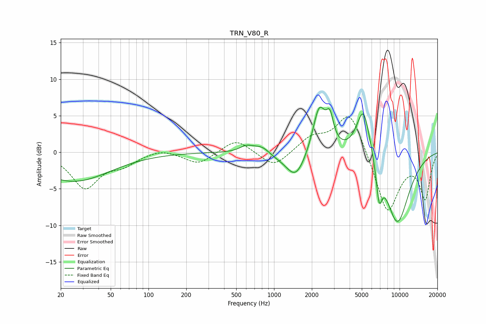

# TRN_V80_R
See [usage instructions](https://github.com/jaakkopasanen/AutoEq#usage) for more options and info.

### Parametric EQs
Apply preamp of -6.3 dB when using parametric equalizer.

|   # | Type    |   Fc (Hz) |    Q |   Gain (dB) |
|-----|---------|-----------|------|-------------|
|   1 | Peaking |        25 | 0.49 |        -4   |
|   2 | Peaking |       600 | 2.72 |         0.8 |
|   3 | Peaking |       807 | 1.92 |         1.1 |
|   4 | Peaking |       987 | 2.15 |        -0.4 |
|   5 | Peaking |      1489 | 1.75 |        -3.8 |
|   6 | Peaking |      2289 | 2.74 |         6.4 |
|   7 | Peaking |      2786 | 5    |         3.4 |
|   8 | Peaking |      5158 | 2.41 |         7.4 |
|   9 | Peaking |      6872 | 6    |        -4.5 |
|  10 | Peaking |      9573 | 1.22 |        -9.8 |

### Fixed Band EQs
When using fixed band (also called graphic) equalizer, apply preamp of **-4.9 dB** (if available) and set gains manually with these parameters.

|   # | Type    |   Fc (Hz) |    Q |   Gain (dB) |
|-----|---------|-----------|------|-------------|
|   1 | Peaking |        31 | 1.41 |        -4.8 |
|   2 | Peaking |        62 | 1.41 |        -1.4 |
|   3 | Peaking |       125 | 1.41 |         0.6 |
|   4 | Peaking |       250 | 1.41 |        -1.7 |
|   5 | Peaking |       500 | 1.41 |         1.9 |
|   6 | Peaking |      1000 | 1.41 |        -2.2 |
|   7 | Peaking |      2000 | 1.41 |         1.9 |
|   8 | Peaking |      4000 | 1.41 |         5.9 |
|   9 | Peaking |      8000 | 1.41 |        -8.5 |
|  10 | Peaking |     16000 | 1.41 |        -6.1 |

### Graphs

