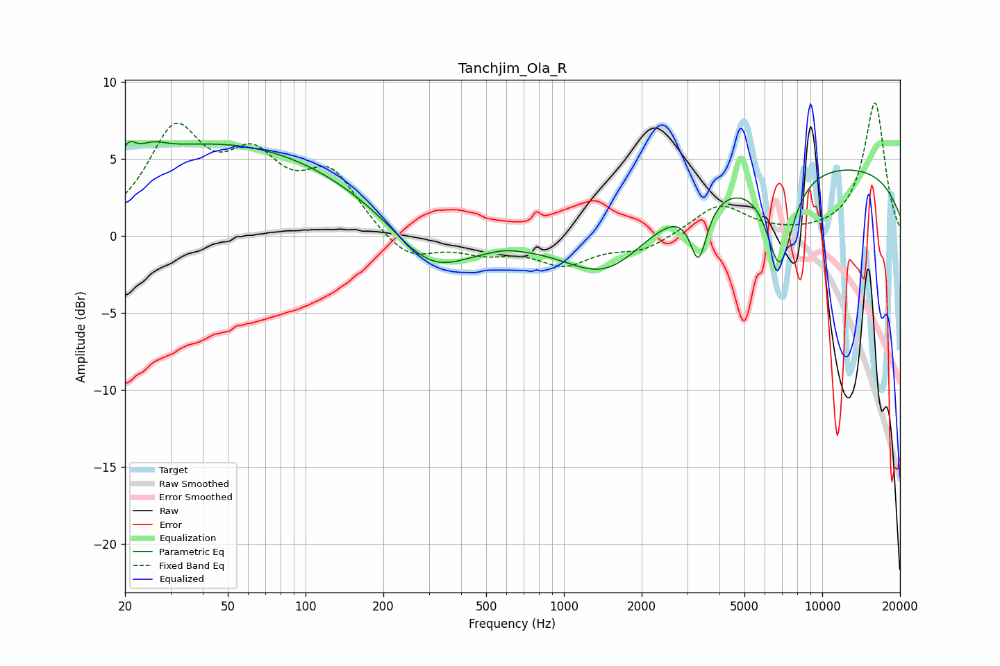

# Tanchjim_Ola_R
See [usage instructions](https://github.com/jaakkopasanen/AutoEq#usage) for more options and info.

### Parametric EQs
Apply preamp of -6.2 dB when using parametric equalizer.

|   # | Type    |   Fc (Hz) |    Q |   Gain (dB) |
|-----|---------|-----------|------|-------------|
|   1 | Peaking |        21 | 5.67 |         1   |
|   2 | Peaking |        25 | 2.61 |         0.7 |
|   3 | Peaking |        47 | 0.26 |         6   |
|   4 | Peaking |       248 | 5.39 |        -0   |
|   5 | Peaking |       308 | 0.94 |        -3.1 |
|   6 | Peaking |       592 | 3.2  |         0.1 |
|   7 | Peaking |      1477 | 0.84 |        -3.7 |
|   8 | Peaking |      3322 | 4.39 |        -3.7 |
|   9 | Peaking |      6842 | 2.66 |        -6.1 |
|  10 | Peaking |      9014 | 0.18 |         4.7 |

### Fixed Band EQs
When using fixed band (also called graphic) equalizer, apply preamp of **-8.7 dB** (if available) and set gains manually with these parameters.

|   # | Type    |   Fc (Hz) |    Q |   Gain (dB) |
|-----|---------|-----------|------|-------------|
|   1 | Peaking |        31 | 1.41 |         6.4 |
|   2 | Peaking |        62 | 1.41 |         4.1 |
|   3 | Peaking |       125 | 1.41 |         3.8 |
|   4 | Peaking |       250 | 1.41 |        -1.7 |
|   5 | Peaking |       500 | 1.41 |        -0.9 |
|   6 | Peaking |      1000 | 1.41 |        -1.7 |
|   7 | Peaking |      2000 | 1.41 |        -0.9 |
|   8 | Peaking |      4000 | 1.41 |         2   |
|   9 | Peaking |      8000 | 1.41 |        -0   |
|  10 | Peaking |     16000 | 1.41 |         8.7 |

### Graphs

