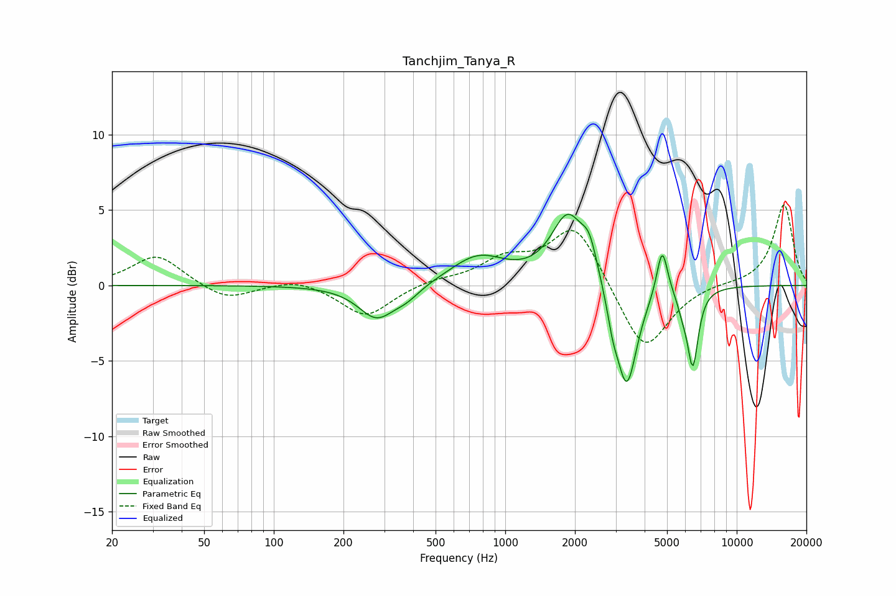

# Tanchjim_Tanya_R
See [usage instructions](https://github.com/jaakkopasanen/AutoEq#usage) for more options and info.

### Parametric EQs
Apply preamp of -4.8 dB when using parametric equalizer.

|   # | Type    |   Fc (Hz) |    Q |   Gain (dB) |
|-----|---------|-----------|------|-------------|
|   1 | Peaking |       278 | 1.81 |        -2.2 |
|   2 | Peaking |       375 | 2.33 |        -0.7 |
|   3 | Peaking |       763 | 1.19 |         1.9 |
|   4 | Peaking |      1866 | 1.97 |         4.5 |
|   5 | Peaking |      2310 | 4.21 |         1.9 |
|   6 | Peaking |      2913 | 5.99 |        -1.4 |
|   7 | Peaking |      3347 | 3.12 |        -7   |
|   8 | Peaking |      4765 | 5.92 |         3.3 |
|   9 | Peaking |      5838 | 6    |        -0.8 |
|  10 | Peaking |      6461 | 5.79 |        -5.1 |

### Fixed Band EQs
When using fixed band (also called graphic) equalizer, apply preamp of **-5.4 dB** (if available) and set gains manually with these parameters.

|   # | Type    |   Fc (Hz) |    Q |   Gain (dB) |
|-----|---------|-----------|------|-------------|
|   1 | Peaking |        31 | 1.41 |         2   |
|   2 | Peaking |        62 | 1.41 |        -1   |
|   3 | Peaking |       125 | 1.41 |         0.5 |
|   4 | Peaking |       250 | 1.41 |        -2.1 |
|   5 | Peaking |       500 | 1.41 |         0.4 |
|   6 | Peaking |      1000 | 1.41 |         1.6 |
|   7 | Peaking |      2000 | 1.41 |         4.1 |
|   8 | Peaking |      4000 | 1.41 |        -4.6 |
|   9 | Peaking |      8000 | 1.41 |         0.1 |
|  10 | Peaking |     16000 | 1.41 |         5.4 |

### Graphs

