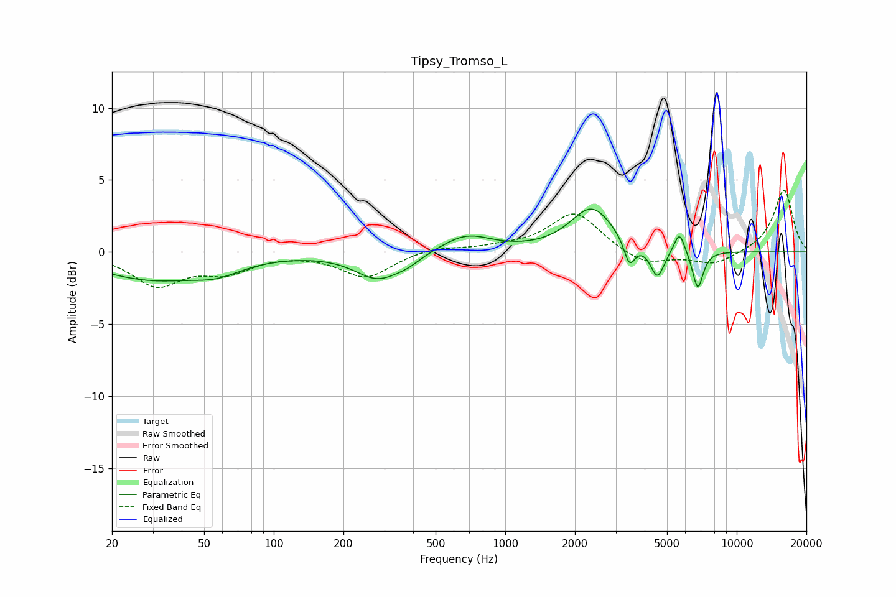

# Tipsy_Tromso_L
See [usage instructions](https://github.com/jaakkopasanen/AutoEq#usage) for more options and info.

### Parametric EQs
Apply preamp of -3.1 dB when using parametric equalizer.

|   # | Type    |   Fc (Hz) |    Q |   Gain (dB) |
|-----|---------|-----------|------|-------------|
|   1 | Peaking |        29 | 0.61 |        -1.8 |
|   2 | Peaking |        57 | 1.3  |        -0.8 |
|   3 | Peaking |       282 | 1.42 |        -1.8 |
|   4 | Peaking |       380 | 2.44 |        -0.4 |
|   5 | Peaking |       677 | 1.31 |         1.2 |
|   6 | Peaking |      2367 | 1.54 |         3   |
|   7 | Peaking |      3440 | 5.99 |        -1.8 |
|   8 | Peaking |      4543 | 4.72 |        -2.1 |
|   9 | Peaking |      5658 | 6    |         1.5 |
|  10 | Peaking |      6790 | 5.95 |        -2.7 |

### Fixed Band EQs
When using fixed band (also called graphic) equalizer, apply preamp of **-4.4 dB** (if available) and set gains manually with these parameters.

|   # | Type    |   Fc (Hz) |    Q |   Gain (dB) |
|-----|---------|-----------|------|-------------|
|   1 | Peaking |        31 | 1.41 |        -2.2 |
|   2 | Peaking |        62 | 1.41 |        -1.2 |
|   3 | Peaking |       125 | 1.41 |        -0   |
|   4 | Peaking |       250 | 1.41 |        -1.8 |
|   5 | Peaking |       500 | 1.41 |         0.4 |
|   6 | Peaking |      1000 | 1.41 |         0.3 |
|   7 | Peaking |      2000 | 1.41 |         2.8 |
|   8 | Peaking |      4000 | 1.41 |        -1   |
|   9 | Peaking |      8000 | 1.41 |        -0.9 |
|  10 | Peaking |     16000 | 1.41 |         4.4 |

### Graphs

