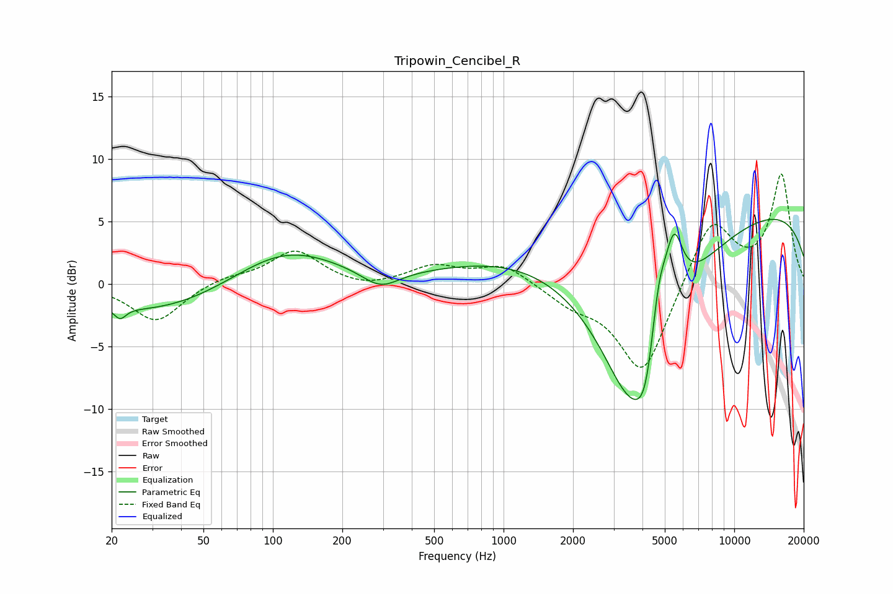

# Tripowin_Cencibel_R
See [usage instructions](https://github.com/jaakkopasanen/AutoEq#usage) for more options and info.

### Parametric EQs
Apply preamp of -5.3 dB when using parametric equalizer.

|   # | Type    |   Fc (Hz) |    Q |   Gain (dB) |
|-----|---------|-----------|------|-------------|
|   1 | Peaking |        22 | 5.58 |        -0.9 |
|   2 | Peaking |        31 | 0.44 |        -2.4 |
|   3 | Peaking |       112 | 0.62 |         3   |
|   4 | Peaking |       292 | 1.73 |        -1.4 |
|   5 | Peaking |      1530 | 0.37 |         3   |
|   6 | Peaking |      3592 | 0.75 |       -15.3 |
|   7 | Peaking |      4171 | 2.97 |        -4.4 |
|   8 | Peaking |      4684 | 3.54 |         5.5 |
|   9 | Peaking |      5480 | 3.49 |         5.6 |
|  10 | Peaking |     10000 | 0.18 |         6.4 |

### Fixed Band EQs
When using fixed band (also called graphic) equalizer, apply preamp of **-8.9 dB** (if available) and set gains manually with these parameters.

|   # | Type    |   Fc (Hz) |    Q |   Gain (dB) |
|-----|---------|-----------|------|-------------|
|   1 | Peaking |        31 | 1.41 |        -3.1 |
|   2 | Peaking |        62 | 1.41 |         0.5 |
|   3 | Peaking |       125 | 1.41 |         2.6 |
|   4 | Peaking |       250 | 1.41 |        -0.5 |
|   5 | Peaking |       500 | 1.41 |         1.4 |
|   6 | Peaking |      1000 | 1.41 |         1.5 |
|   7 | Peaking |      2000 | 1.41 |        -1.3 |
|   8 | Peaking |      4000 | 1.41 |        -7.4 |
|   9 | Peaking |      8000 | 1.41 |         5.3 |
|  10 | Peaking |     16000 | 1.41 |         8.6 |

### Graphs

