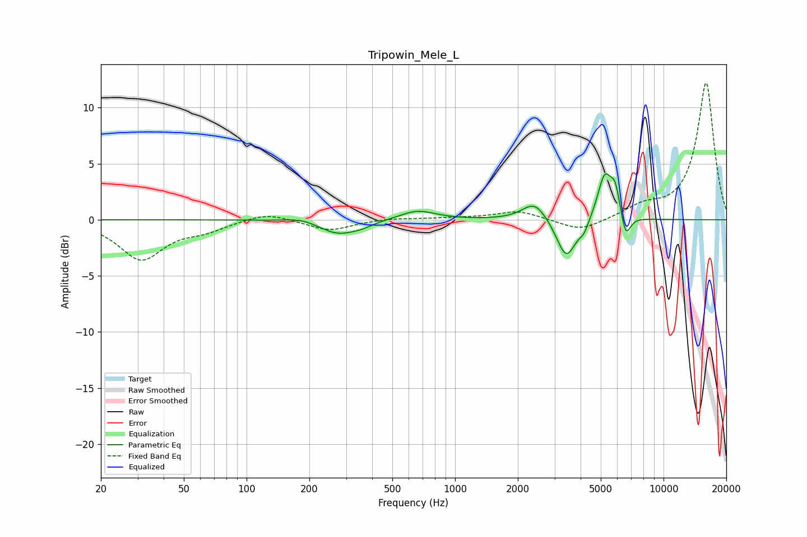

# Tripowin_Mele_L
See [usage instructions](https://github.com/jaakkopasanen/AutoEq#usage) for more options and info.

### Parametric EQs
Apply preamp of -4.2 dB when using parametric equalizer.

|   # | Type    |   Fc (Hz) |    Q |   Gain (dB) |
|-----|---------|-----------|------|-------------|
|   1 | Peaking |       184 | 1.92 |         0.4 |
|   2 | Peaking |       273 | 1.55 |        -1.3 |
|   3 | Peaking |       355 | 2.56 |        -0.3 |
|   4 | Peaking |       661 | 1.65 |         0.9 |
|   5 | Peaking |      2409 | 2.41 |         1.7 |
|   6 | Peaking |      3416 | 3.02 |        -3.6 |
|   7 | Peaking |      4149 | 6    |        -0.8 |
|   8 | Peaking |      5219 | 4.05 |         4   |
|   9 | Peaking |      5866 | 6    |         2.3 |
|  10 | Peaking |      6593 | 6    |        -2.1 |

### Fixed Band EQs
When using fixed band (also called graphic) equalizer, apply preamp of **-12.3 dB** (if available) and set gains manually with these parameters.

|   # | Type    |   Fc (Hz) |    Q |   Gain (dB) |
|-----|---------|-----------|------|-------------|
|   1 | Peaking |        31 | 1.41 |        -3.5 |
|   2 | Peaking |        62 | 1.41 |        -0.8 |
|   3 | Peaking |       125 | 1.41 |         0.7 |
|   4 | Peaking |       250 | 1.41 |        -1   |
|   5 | Peaking |       500 | 1.41 |         0.2 |
|   6 | Peaking |      1000 | 1.41 |         0.1 |
|   7 | Peaking |      2000 | 1.41 |         0.8 |
|   8 | Peaking |      4000 | 1.41 |        -1.1 |
|   9 | Peaking |      8000 | 1.41 |         1   |
|  10 | Peaking |     16000 | 1.41 |        12.2 |

### Graphs

