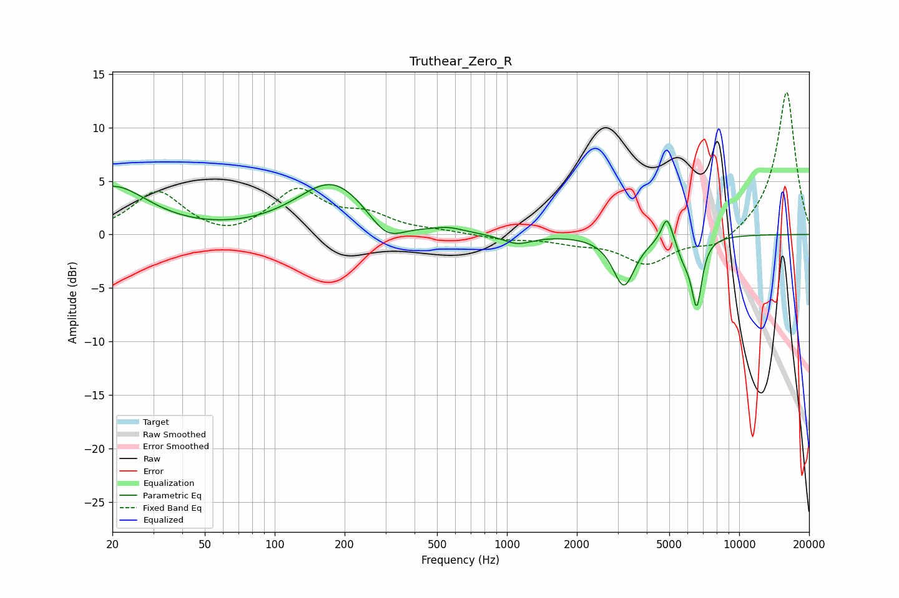

# Truthear_Zero_R
See [usage instructions](https://github.com/jaakkopasanen/AutoEq#usage) for more options and info.

### Parametric EQs
Apply preamp of -4.8 dB when using parametric equalizer.

|   # | Type    |   Fc (Hz) |    Q |   Gain (dB) |
|-----|---------|-----------|------|-------------|
|   1 | Peaking |        20 | 0.93 |         4.4 |
|   2 | Peaking |       178 | 0.91 |         5   |
|   3 | Peaking |       302 | 1.85 |        -2.2 |
|   4 | Peaking |       562 | 2.34 |         0.4 |
|   5 | Peaking |      1106 | 2.14 |        -0.9 |
|   6 | Peaking |      3189 | 3    |        -4.7 |
|   7 | Peaking |      4888 | 5.89 |         2.5 |
|   8 | Peaking |      5638 | 6    |        -0.8 |
|   9 | Peaking |      5962 | 5.24 |        -0.9 |
|  10 | Peaking |      6563 | 6    |        -6.2 |

### Fixed Band EQs
When using fixed band (also called graphic) equalizer, apply preamp of **-13.4 dB** (if available) and set gains manually with these parameters.

|   # | Type    |   Fc (Hz) |    Q |   Gain (dB) |
|-----|---------|-----------|------|-------------|
|   1 | Peaking |        31 | 1.41 |         4   |
|   2 | Peaking |        62 | 1.41 |        -0.7 |
|   3 | Peaking |       125 | 1.41 |         4   |
|   4 | Peaking |       250 | 1.41 |         1.5 |
|   5 | Peaking |       500 | 1.41 |         0.2 |
|   6 | Peaking |      1000 | 1.41 |        -0.4 |
|   7 | Peaking |      2000 | 1.41 |        -0.6 |
|   8 | Peaking |      4000 | 1.41 |        -2.7 |
|   9 | Peaking |      8000 | 1.41 |        -1.3 |
|  10 | Peaking |     16000 | 1.41 |        13.5 |

### Graphs

