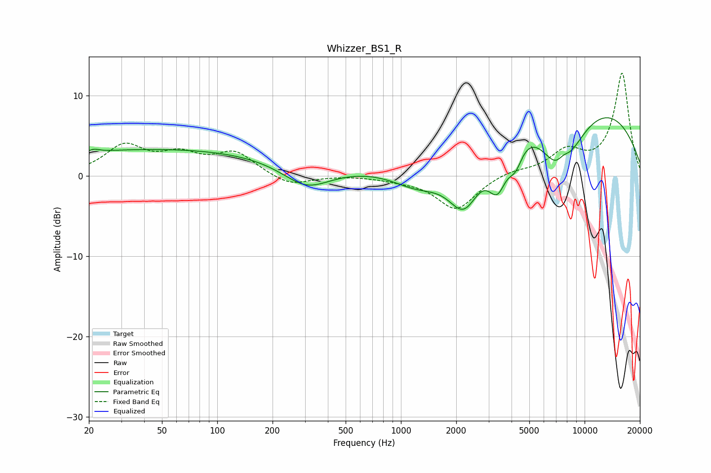

# Whizzer_BS1_R
See [usage instructions](https://github.com/jaakkopasanen/AutoEq#usage) for more options and info.

### Parametric EQs
Apply preamp of -7.3 dB when using parametric equalizer.

|   # | Type    |   Fc (Hz) |    Q |   Gain (dB) |
|-----|---------|-----------|------|-------------|
|   1 | Peaking |        21 | 5.13 |         0.4 |
|   2 | Peaking |        50 | 0.18 |         3.3 |
|   3 | Peaking |       305 | 1.1  |        -2.8 |
|   4 | Peaking |      1262 | 0.84 |        -4.7 |
|   5 | Peaking |      2214 | 1.36 |        -9.2 |
|   6 | Peaking |      3357 | 2.55 |        -6   |
|   7 | Peaking |      4200 | 3.45 |        -3.1 |
|   8 | Peaking |      6415 | 0.23 |        14.7 |
|   9 | Peaking |      7391 | 0.96 |       -13.1 |
|  10 | Peaking |      7648 | 3.31 |         1.9 |

### Fixed Band EQs
When using fixed band (also called graphic) equalizer, apply preamp of **-12.9 dB** (if available) and set gains manually with these parameters.

|   # | Type    |   Fc (Hz) |    Q |   Gain (dB) |
|-----|---------|-----------|------|-------------|
|   1 | Peaking |        31 | 1.41 |         3.6 |
|   2 | Peaking |        62 | 1.41 |         2.2 |
|   3 | Peaking |       125 | 1.41 |         2.8 |
|   4 | Peaking |       250 | 1.41 |        -1.3 |
|   5 | Peaking |       500 | 1.41 |         0.1 |
|   6 | Peaking |      1000 | 1.41 |        -0.3 |
|   7 | Peaking |      2000 | 1.41 |        -4.2 |
|   8 | Peaking |      4000 | 1.41 |         0.6 |
|   9 | Peaking |      8000 | 1.41 |         2.8 |
|  10 | Peaking |     16000 | 1.41 |        12.7 |

### Graphs

