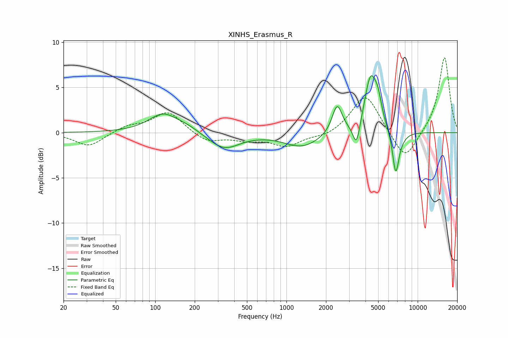

# XINHS_Erasmus_R
See [usage instructions](https://github.com/jaakkopasanen/AutoEq#usage) for more options and info.

### Parametric EQs
Apply preamp of -6.4 dB when using parametric equalizer.

|   # | Type    |   Fc (Hz) |    Q |   Gain (dB) |
|-----|---------|-----------|------|-------------|
|   1 | Peaking |       115 | 1.26 |         2.1 |
|   2 | Peaking |       179 | 1.51 |         0.5 |
|   3 | Peaking |       334 | 1.21 |        -1.8 |
|   4 | Peaking |      1316 | 1.05 |        -1.6 |
|   5 | Peaking |      2434 | 3.69 |         3.2 |
|   6 | Peaking |      3421 | 5.07 |        -2.8 |
|   7 | Peaking |      4376 | 2.94 |         6.1 |
|   8 | Peaking |      4984 | 4.94 |         1.9 |
|   9 | Peaking |      6797 | 5.68 |        -4.5 |
|  10 | Peaking |      7316 | 2.85 |        -0.7 |

### Fixed Band EQs
When using fixed band (also called graphic) equalizer, apply preamp of **-8.4 dB** (if available) and set gains manually with these parameters.

|   # | Type    |   Fc (Hz) |    Q |   Gain (dB) |
|-----|---------|-----------|------|-------------|
|   1 | Peaking |        31 | 1.41 |        -1.5 |
|   2 | Peaking |        62 | 1.41 |         0.7 |
|   3 | Peaking |       125 | 1.41 |         2.3 |
|   4 | Peaking |       250 | 1.41 |        -1.1 |
|   5 | Peaking |       500 | 1.41 |        -0.7 |
|   6 | Peaking |      1000 | 1.41 |        -1.4 |
|   7 | Peaking |      2000 | 1.41 |        -0.5 |
|   8 | Peaking |      4000 | 1.41 |         4.4 |
|   9 | Peaking |      8000 | 1.41 |        -3.3 |
|  10 | Peaking |     16000 | 1.41 |         8.4 |

### Graphs

