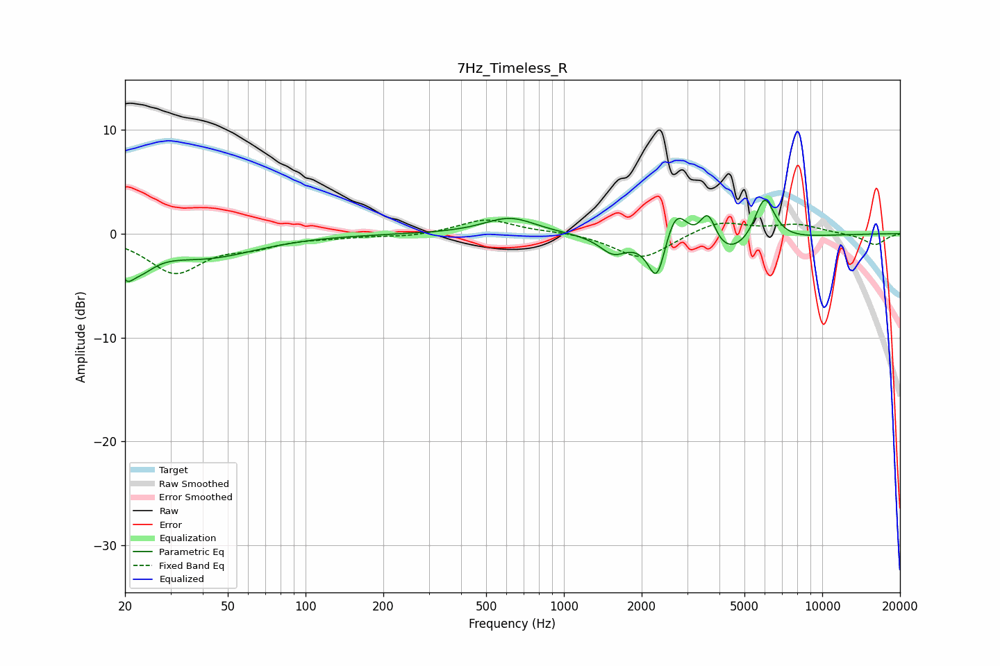

# 7Hz_Timeless_R
See [usage instructions](https://github.com/jaakkopasanen/AutoEq#usage) for more options and info.

### Parametric EQs
Apply preamp of -3.3 dB when using parametric equalizer.

|   # | Type    |   Fc (Hz) |    Q |   Gain (dB) |
|-----|---------|-----------|------|-------------|
|   1 | Peaking |        20 | 5.1  |        -2   |
|   2 | Peaking |        23 | 2.43 |        -2   |
|   3 | Peaking |        41 | 0.71 |        -2.2 |
|   4 | Peaking |       618 | 1.41 |         1.6 |
|   5 | Peaking |      1551 | 2.8  |        -1.6 |
|   6 | Peaking |      2295 | 4.16 |        -4.6 |
|   7 | Peaking |      2712 | 2.78 |         4.5 |
|   8 | Peaking |      3609 | 4.18 |         3.8 |
|   9 | Peaking |      3811 | 0.96 |        -3.3 |
|  10 | Peaking |      5976 | 3.42 |         4.6 |

### Fixed Band EQs
When using fixed band (also called graphic) equalizer, apply preamp of **-1.4 dB** (if available) and set gains manually with these parameters.

|   # | Type    |   Fc (Hz) |    Q |   Gain (dB) |
|-----|---------|-----------|------|-------------|
|   1 | Peaking |        31 | 1.41 |        -3.7 |
|   2 | Peaking |        62 | 1.41 |        -1   |
|   3 | Peaking |       125 | 1.41 |        -0.2 |
|   4 | Peaking |       250 | 1.41 |        -0.3 |
|   5 | Peaking |       500 | 1.41 |         1.4 |
|   6 | Peaking |      1000 | 1.41 |         0.2 |
|   7 | Peaking |      2000 | 1.41 |        -2.5 |
|   8 | Peaking |      4000 | 1.41 |         1.3 |
|   9 | Peaking |      8000 | 1.41 |         0.8 |
|  10 | Peaking |     16000 | 1.41 |        -1.1 |

### Graphs

