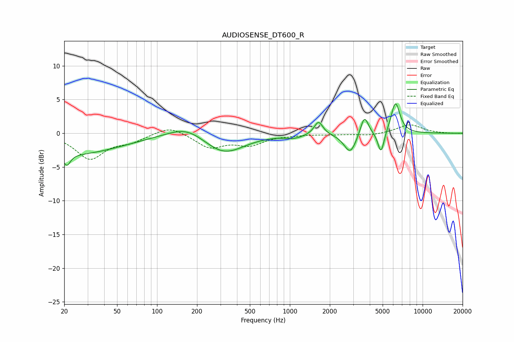

# AUDIOSENSE_DT600_R
See [usage instructions](https://github.com/jaakkopasanen/AutoEq#usage) for more options and info.

### Parametric EQs
Apply preamp of -4.5 dB when using parametric equalizer.

|   # | Type    |   Fc (Hz) |    Q |   Gain (dB) |
|-----|---------|-----------|------|-------------|
|   1 | Peaking |        21 | 5.46 |        -1.8 |
|   2 | Peaking |        24 | 0.39 |        -3   |
|   3 | Peaking |       167 | 1.03 |         1.7 |
|   4 | Peaking |       319 | 0.93 |        -3.1 |
|   5 | Peaking |      1087 | 2.07 |        -0.5 |
|   6 | Peaking |      1644 | 4.37 |         2   |
|   7 | Peaking |      2850 | 3.05 |        -3   |
|   8 | Peaking |      3642 | 4.7  |         3   |
|   9 | Peaking |      4860 | 5.92 |        -3.3 |
|  10 | Peaking |      6244 | 4.13 |         4.7 |

### Fixed Band EQs
When using fixed band (also called graphic) equalizer, apply preamp of **-1.3 dB** (if available) and set gains manually with these parameters.

|   # | Type    |   Fc (Hz) |    Q |   Gain (dB) |
|-----|---------|-----------|------|-------------|
|   1 | Peaking |        31 | 1.41 |        -3.7 |
|   2 | Peaking |        62 | 1.41 |        -1.1 |
|   3 | Peaking |       125 | 1.41 |         1.2 |
|   4 | Peaking |       250 | 1.41 |        -2.1 |
|   5 | Peaking |       500 | 1.41 |        -1.6 |
|   6 | Peaking |      1000 | 1.41 |        -0.2 |
|   7 | Peaking |      2000 | 1.41 |        -0.1 |
|   8 | Peaking |      4000 | 1.41 |        -0.4 |
|   9 | Peaking |      8000 | 1.41 |         1.3 |
|  10 | Peaking |     16000 | 1.41 |        -0   |

### Graphs

