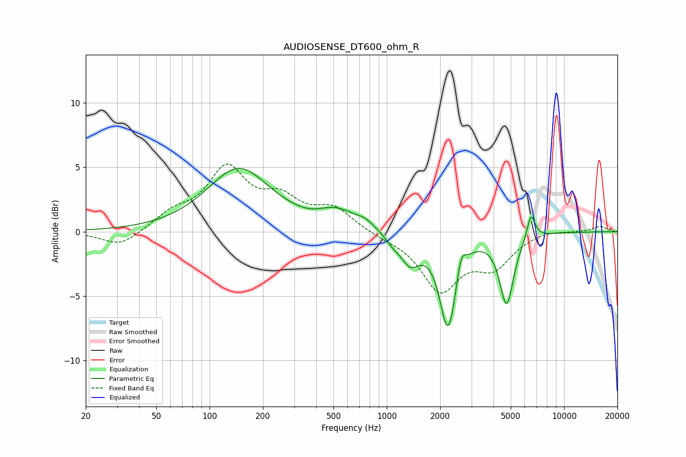

# AUDIOSENSE_DT600_ohm_R
See [usage instructions](https://github.com/jaakkopasanen/AutoEq#usage) for more options and info.

### Parametric EQs
Apply preamp of -5.0 dB when using parametric equalizer.

|   # | Type    |   Fc (Hz) |    Q |   Gain (dB) |
|-----|---------|-----------|------|-------------|
|   1 | Peaking |       146 | 0.8  |         4.9 |
|   2 | Peaking |       369 | 2.09 |        -0.2 |
|   3 | Peaking |       524 | 1.26 |         1.3 |
|   4 | Peaking |       754 | 2.94 |         0.4 |
|   5 | Peaking |      1078 | 3.44 |        -0.5 |
|   6 | Peaking |      1353 | 2.56 |        -2.1 |
|   7 | Peaking |      2216 | 3    |        -7.3 |
|   8 | Peaking |      2623 | 6    |         1.6 |
|   9 | Peaking |      4741 | 3.56 |        -5.4 |
|  10 | Peaking |      6513 | 5.99 |         2   |

### Fixed Band EQs
When using fixed band (also called graphic) equalizer, apply preamp of **-5.4 dB** (if available) and set gains manually with these parameters.

|   # | Type    |   Fc (Hz) |    Q |   Gain (dB) |
|-----|---------|-----------|------|-------------|
|   1 | Peaking |        31 | 1.41 |        -1.2 |
|   2 | Peaking |        62 | 1.41 |         1.2 |
|   3 | Peaking |       125 | 1.41 |         4.6 |
|   4 | Peaking |       250 | 1.41 |         2.1 |
|   5 | Peaking |       500 | 1.41 |         1.7 |
|   6 | Peaking |      1000 | 1.41 |        -0.3 |
|   7 | Peaking |      2000 | 1.41 |        -4.4 |
|   8 | Peaking |      4000 | 1.41 |        -2.4 |
|   9 | Peaking |      8000 | 1.41 |         0.2 |
|  10 | Peaking |     16000 | 1.41 |         0.4 |

### Graphs

