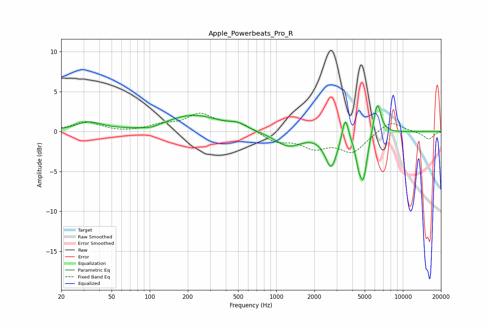

# Apple_Powerbeats_Pro_R
See [usage instructions](https://github.com/jaakkopasanen/AutoEq#usage) for more options and info.

### Parametric EQs
Apply preamp of -3.3 dB when using parametric equalizer.

|   # | Type    |   Fc (Hz) |    Q |   Gain (dB) |
|-----|---------|-----------|------|-------------|
|   1 | Peaking |        33 | 1.37 |         1.1 |
|   2 | Peaking |       102 | 1.81 |        -0.4 |
|   3 | Peaking |       220 | 0.67 |         2   |
|   4 | Peaking |       494 | 2.24 |         0.6 |
|   5 | Peaking |      1241 | 1.32 |        -1.8 |
|   6 | Peaking |      2715 | 2.96 |        -4.2 |
|   7 | Peaking |      3504 | 5.75 |         3.1 |
|   8 | Peaking |      4458 | 5.93 |        -1.9 |
|   9 | Peaking |      4877 | 4.42 |        -5.5 |
|  10 | Peaking |      6275 | 4.63 |         4.2 |

### Fixed Band EQs
When using fixed band (also called graphic) equalizer, apply preamp of **-2.4 dB** (if available) and set gains manually with these parameters.

|   # | Type    |   Fc (Hz) |    Q |   Gain (dB) |
|-----|---------|-----------|------|-------------|
|   1 | Peaking |        31 | 1.41 |         1.2 |
|   2 | Peaking |        62 | 1.41 |        -0.1 |
|   3 | Peaking |       125 | 1.41 |         0.7 |
|   4 | Peaking |       250 | 1.41 |         2   |
|   5 | Peaking |       500 | 1.41 |         1   |
|   6 | Peaking |      1000 | 1.41 |        -1.2 |
|   7 | Peaking |      2000 | 1.41 |        -1.8 |
|   8 | Peaking |      4000 | 1.41 |        -2.5 |
|   9 | Peaking |      8000 | 1.41 |         1.4 |
|  10 | Peaking |     16000 | 1.41 |        -1   |

### Graphs

