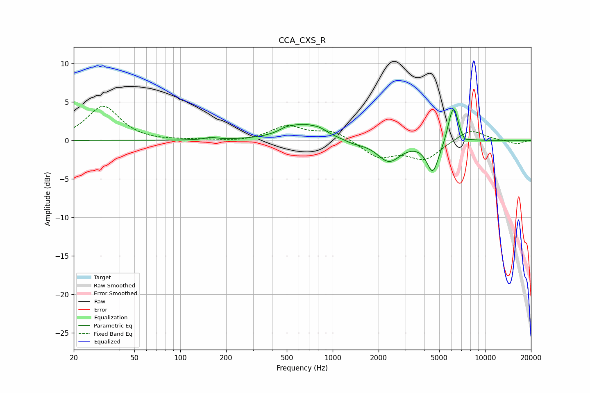

# CCA_CXS_R
See [usage instructions](https://github.com/jaakkopasanen/AutoEq#usage) for more options and info.

### Parametric EQs
Apply preamp of -4.1 dB when using parametric equalizer.

|   # | Type    |   Fc (Hz) |    Q |   Gain (dB) |
|-----|---------|-----------|------|-------------|
|   1 | Peaking |       159 | 3.71 |         0.3 |
|   2 | Peaking |       490 | 3.63 |         0.3 |
|   3 | Peaking |       638 | 1.19 |         2   |
|   4 | Peaking |       827 | 3.21 |         0.4 |
|   5 | Peaking |      1381 | 2.29 |        -0.4 |
|   6 | Peaking |      2335 | 1.86 |        -2.7 |
|   7 | Peaking |      4538 | 3.52 |        -4   |
|   8 | Peaking |      5880 | 5.98 |         1.1 |
|   9 | Peaking |      6259 | 4.67 |         4.1 |
|  10 | Peaking |      7321 | 6    |        -0.5 |

### Fixed Band EQs
When using fixed band (also called graphic) equalizer, apply preamp of **-4.5 dB** (if available) and set gains manually with these parameters.

|   # | Type    |   Fc (Hz) |    Q |   Gain (dB) |
|-----|---------|-----------|------|-------------|
|   1 | Peaking |        31 | 1.41 |         4.4 |
|   2 | Peaking |        62 | 1.41 |        -0.1 |
|   3 | Peaking |       125 | 1.41 |         0.1 |
|   4 | Peaking |       250 | 1.41 |        -0.2 |
|   5 | Peaking |       500 | 1.41 |         1.8 |
|   6 | Peaking |      1000 | 1.41 |         1.2 |
|   7 | Peaking |      2000 | 1.41 |        -2.1 |
|   8 | Peaking |      4000 | 1.41 |        -2.4 |
|   9 | Peaking |      8000 | 1.41 |         1.5 |
|  10 | Peaking |     16000 | 1.41 |        -0.5 |

### Graphs

