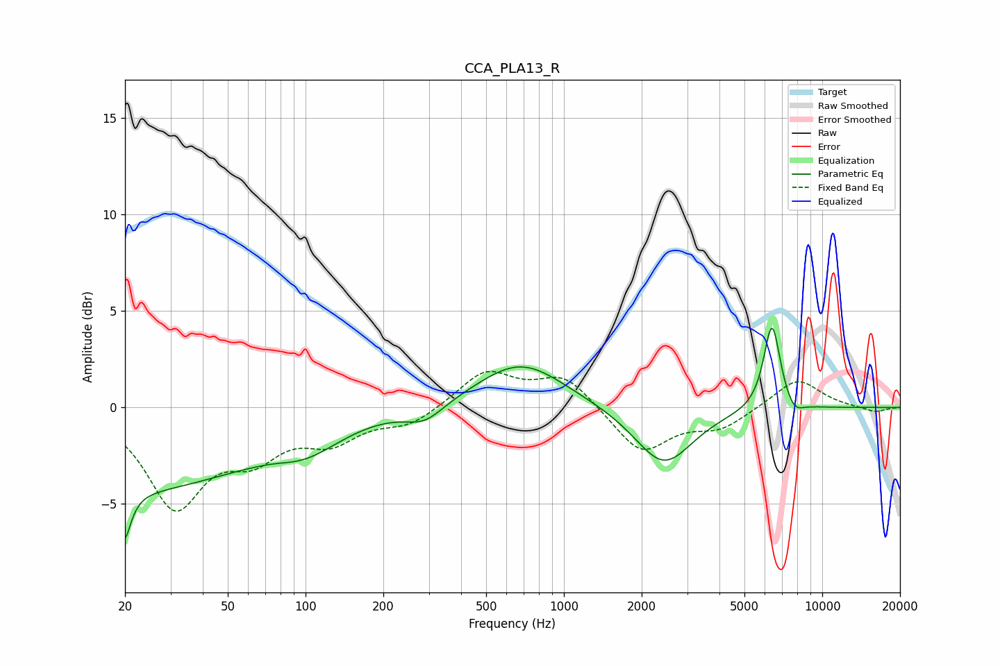

# CCA_PLA13_R
See [usage instructions](https://github.com/jaakkopasanen/AutoEq#usage) for more options and info.

### Parametric EQs
Apply preamp of -4.2 dB when using parametric equalizer.

|   # | Type    |   Fc (Hz) |    Q |   Gain (dB) |
|-----|---------|-----------|------|-------------|
|   1 | Peaking |        20 | 5.64 |        -4.3 |
|   2 | Peaking |        20 | 0.29 |        -4.2 |
|   3 | Peaking |        20 | 6    |         1.8 |
|   4 | Peaking |        76 | 1.95 |         0.1 |
|   5 | Peaking |       100 | 1    |        -1.3 |
|   6 | Peaking |       289 | 1.89 |        -0.9 |
|   7 | Peaking |       680 | 0.84 |         2.4 |
|   8 | Peaking |      2434 | 1.27 |        -3   |
|   9 | Peaking |      6389 | 4.24 |         4.5 |
|  10 | Peaking |      7792 | 3.91 |        -0.6 |

### Fixed Band EQs
When using fixed band (also called graphic) equalizer, apply preamp of **-2.0 dB** (if available) and set gains manually with these parameters.

|   # | Type    |   Fc (Hz) |    Q |   Gain (dB) |
|-----|---------|-----------|------|-------------|
|   1 | Peaking |        31 | 1.41 |        -4.9 |
|   2 | Peaking |        62 | 1.41 |        -2.1 |
|   3 | Peaking |       125 | 1.41 |        -1.5 |
|   4 | Peaking |       250 | 1.41 |        -0.8 |
|   5 | Peaking |       500 | 1.41 |         1.9 |
|   6 | Peaking |      1000 | 1.41 |         1.6 |
|   7 | Peaking |      2000 | 1.41 |        -2.4 |
|   8 | Peaking |      4000 | 1.41 |        -1   |
|   9 | Peaking |      8000 | 1.41 |         1.5 |
|  10 | Peaking |     16000 | 1.41 |        -0.3 |

### Graphs

