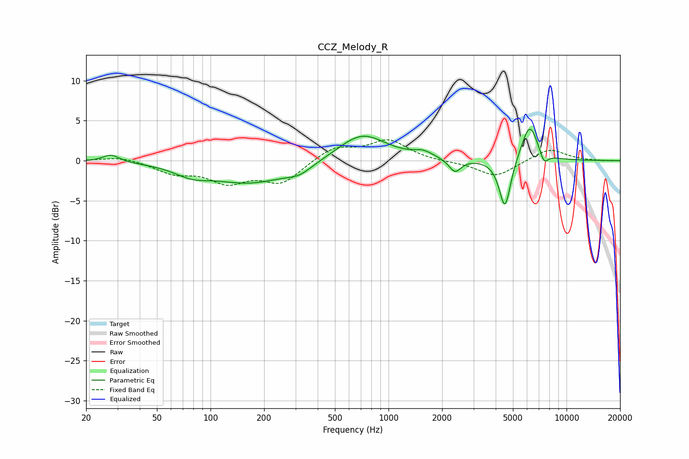

# CCZ_Melody_R
See [usage instructions](https://github.com/jaakkopasanen/AutoEq#usage) for more options and info.

### Parametric EQs
Apply preamp of -4.0 dB when using parametric equalizer.

|   # | Type    |   Fc (Hz) |    Q |   Gain (dB) |
|-----|---------|-----------|------|-------------|
|   1 | Peaking |        28 | 3.15 |         0.9 |
|   2 | Peaking |        78 | 1.49 |        -1.1 |
|   3 | Peaking |       168 | 0.63 |        -2.7 |
|   4 | Peaking |       315 | 2.05 |        -0.9 |
|   5 | Peaking |       709 | 1.04 |         3.5 |
|   6 | Peaking |      1569 | 2.62 |         0.7 |
|   7 | Peaking |      2362 | 4.21 |        -1.7 |
|   8 | Peaking |      4510 | 4.34 |        -6.3 |
|   9 | Peaking |      6209 | 2.9  |         4.8 |
|  10 | Peaking |      7464 | 5.57 |        -1.6 |

### Fixed Band EQs
When using fixed band (also called graphic) equalizer, apply preamp of **-2.7 dB** (if available) and set gains manually with these parameters.

|   # | Type    |   Fc (Hz) |    Q |   Gain (dB) |
|-----|---------|-----------|------|-------------|
|   1 | Peaking |        31 | 1.41 |         0.6 |
|   2 | Peaking |        62 | 1.41 |        -1.4 |
|   3 | Peaking |       125 | 1.41 |        -2.4 |
|   4 | Peaking |       250 | 1.41 |        -2.7 |
|   5 | Peaking |       500 | 1.41 |         1.7 |
|   6 | Peaking |      1000 | 1.41 |         2.5 |
|   7 | Peaking |      2000 | 1.41 |        -0.1 |
|   8 | Peaking |      4000 | 1.41 |        -2   |
|   9 | Peaking |      8000 | 1.41 |         1.5 |
|  10 | Peaking |     16000 | 1.41 |        -0   |

### Graphs

