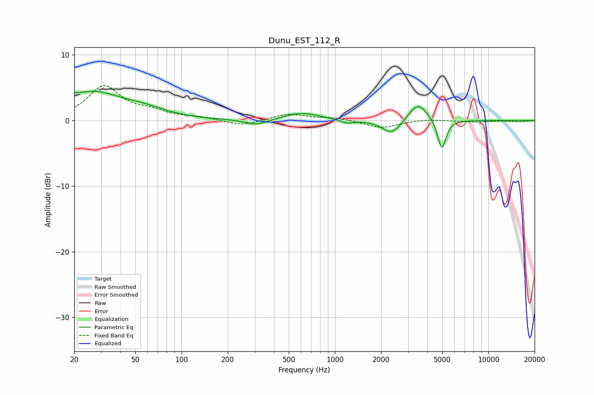

# Dunu_EST_112_R
See [usage instructions](https://github.com/jaakkopasanen/AutoEq#usage) for more options and info.

### Parametric EQs
Apply preamp of -4.6 dB when using parametric equalizer.

|   # | Type    |   Fc (Hz) |    Q |   Gain (dB) |
|-----|---------|-----------|------|-------------|
|   1 | Peaking |        20 | 5.98 |         3.1 |
|   2 | Peaking |        20 | 5.99 |        -2.7 |
|   3 | Peaking |        26 | 0.72 |         4.2 |
|   4 | Peaking |        58 | 0.98 |         1   |
|   5 | Peaking |       308 | 1.93 |        -0.9 |
|   6 | Peaking |       607 | 1.23 |         1.2 |
|   7 | Peaking |      1201 | 3.2  |        -0.5 |
|   8 | Peaking |      2350 | 2.32 |        -2.3 |
|   9 | Peaking |      3476 | 2.29 |         2.9 |
|  10 | Peaking |      4971 | 5.15 |        -4.7 |

### Fixed Band EQs
When using fixed band (also called graphic) equalizer, apply preamp of **-5.4 dB** (if available) and set gains manually with these parameters.

|   # | Type    |   Fc (Hz) |    Q |   Gain (dB) |
|-----|---------|-----------|------|-------------|
|   1 | Peaking |        31 | 1.41 |         5.1 |
|   2 | Peaking |        62 | 1.41 |         1.1 |
|   3 | Peaking |       125 | 1.41 |         0.4 |
|   4 | Peaking |       250 | 1.41 |        -0.9 |
|   5 | Peaking |       500 | 1.41 |         1   |
|   6 | Peaking |      1000 | 1.41 |         0.4 |
|   7 | Peaking |      2000 | 1.41 |        -1.2 |
|   8 | Peaking |      4000 | 1.41 |         0.2 |
|   9 | Peaking |      8000 | 1.41 |        -0.2 |
|  10 | Peaking |     16000 | 1.41 |        -0.2 |

### Graphs

