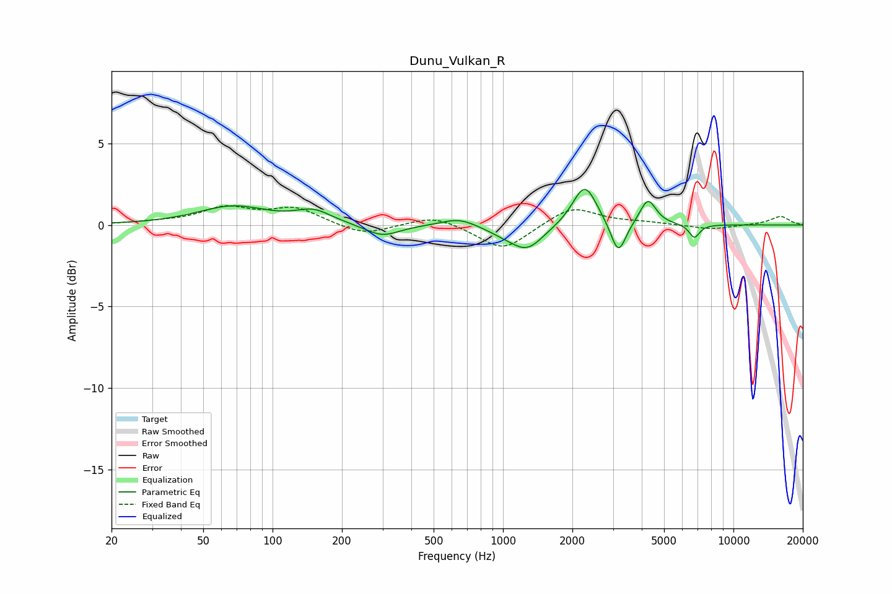

# Dunu_Vulkan_R
See [usage instructions](https://github.com/jaakkopasanen/AutoEq#usage) for more options and info.

### Parametric EQs
Apply preamp of -2.3 dB when using parametric equalizer.

|   # | Type    |   Fc (Hz) |    Q |   Gain (dB) |
|-----|---------|-----------|------|-------------|
|   1 | Peaking |        67 | 0.94 |         1.1 |
|   2 | Peaking |       151 | 1.85 |         0.7 |
|   3 | Peaking |       299 | 1.85 |        -0.7 |
|   4 | Peaking |       645 | 1.87 |         0.5 |
|   5 | Peaking |      1021 | 1.73 |        -0.4 |
|   6 | Peaking |      1277 | 2.01 |        -1.4 |
|   7 | Peaking |      2263 | 2.71 |         2.6 |
|   8 | Peaking |      3166 | 4.37 |        -2.1 |
|   9 | Peaking |      4256 | 4.05 |         1.6 |
|  10 | Peaking |      6770 | 6    |        -0.8 |

### Fixed Band EQs
When using fixed band (also called graphic) equalizer, apply preamp of **-1.3 dB** (if available) and set gains manually with these parameters.

|   # | Type    |   Fc (Hz) |    Q |   Gain (dB) |
|-----|---------|-----------|------|-------------|
|   1 | Peaking |        31 | 1.41 |         0.1 |
|   2 | Peaking |        62 | 1.41 |         1   |
|   3 | Peaking |       125 | 1.41 |         1   |
|   4 | Peaking |       250 | 1.41 |        -0.7 |
|   5 | Peaking |       500 | 1.41 |         0.6 |
|   6 | Peaking |      1000 | 1.41 |        -1.6 |
|   7 | Peaking |      2000 | 1.41 |         1.2 |
|   8 | Peaking |      4000 | 1.41 |         0.1 |
|   9 | Peaking |      8000 | 1.41 |        -0.3 |
|  10 | Peaking |     16000 | 1.41 |         0.5 |

### Graphs

