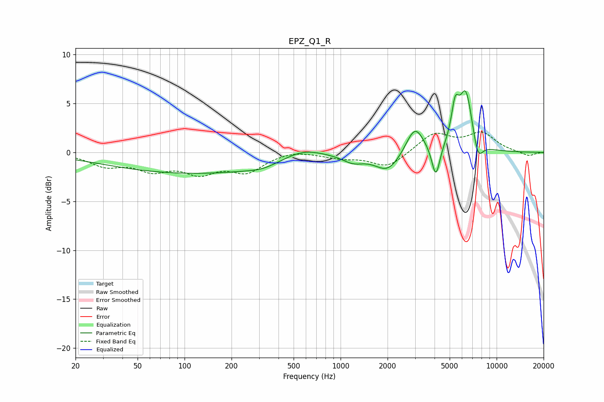

# EPZ_Q1_R
See [usage instructions](https://github.com/jaakkopasanen/AutoEq#usage) for more options and info.

### Parametric EQs
Apply preamp of -6.4 dB when using parametric equalizer.

|   # | Type    |   Fc (Hz) |    Q |   Gain (dB) |
|-----|---------|-----------|------|-------------|
|   1 | Peaking |       126 | 0.22 |        -2.2 |
|   2 | Peaking |       314 | 1.68 |        -0.3 |
|   3 | Peaking |       571 | 1.03 |         1.3 |
|   4 | Peaking |      1202 | 2.11 |        -0.8 |
|   5 | Peaking |      2010 | 1.74 |        -1.9 |
|   6 | Peaking |      2995 | 2.52 |         2.8 |
|   7 | Peaking |      4078 | 5.44 |        -3.3 |
|   8 | Peaking |      5421 | 5.71 |         3.4 |
|   9 | Peaking |      6348 | 3.14 |         6.1 |
|  10 | Peaking |      7582 | 4.23 |        -2.2 |

### Fixed Band EQs
When using fixed band (also called graphic) equalizer, apply preamp of **-2.2 dB** (if available) and set gains manually with these parameters.

|   # | Type    |   Fc (Hz) |    Q |   Gain (dB) |
|-----|---------|-----------|------|-------------|
|   1 | Peaking |        31 | 1.41 |        -1.2 |
|   2 | Peaking |        62 | 1.41 |        -1.6 |
|   3 | Peaking |       125 | 1.41 |        -1.8 |
|   4 | Peaking |       250 | 1.41 |        -1.8 |
|   5 | Peaking |       500 | 1.41 |         0.3 |
|   6 | Peaking |      1000 | 1.41 |        -0.5 |
|   7 | Peaking |      2000 | 1.41 |        -1.5 |
|   8 | Peaking |      4000 | 1.41 |         1.9 |
|   9 | Peaking |      8000 | 1.41 |         1.9 |
|  10 | Peaking |     16000 | 1.41 |        -0.4 |

### Graphs

