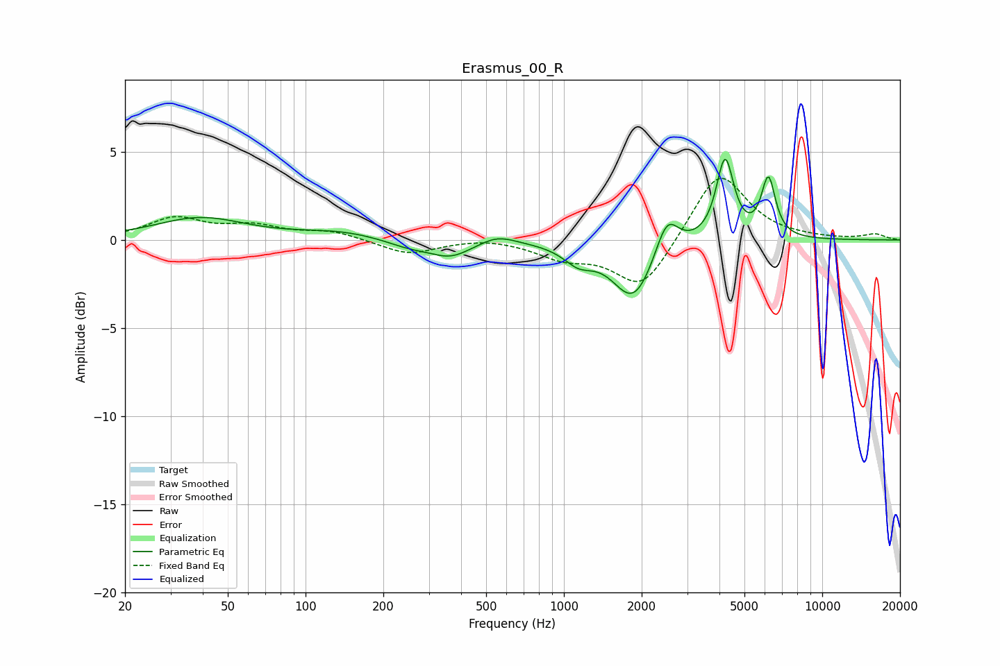

# Erasmus_00_R
See [usage instructions](https://github.com/jaakkopasanen/AutoEq#usage) for more options and info.

### Parametric EQs
Apply preamp of -4.7 dB when using parametric equalizer.

|   # | Type    |   Fc (Hz) |    Q |   Gain (dB) |
|-----|---------|-----------|------|-------------|
|   1 | Peaking |        39 | 0.81 |         1.2 |
|   2 | Peaking |       135 | 0.89 |         0.4 |
|   3 | Peaking |       251 | 1.58 |        -0.4 |
|   4 | Peaking |       364 | 1.71 |        -0.9 |
|   5 | Peaking |       553 | 2.07 |         0.5 |
|   6 | Peaking |      1139 | 2.44 |        -0.9 |
|   7 | Peaking |      1860 | 1.77 |        -3.4 |
|   8 | Peaking |      2504 | 3.22 |         2.1 |
|   9 | Peaking |      4205 | 4.24 |         4.6 |
|  10 | Peaking |      6188 | 5.09 |         3.3 |

### Fixed Band EQs
When using fixed band (also called graphic) equalizer, apply preamp of **-3.6 dB** (if available) and set gains manually with these parameters.

|   # | Type    |   Fc (Hz) |    Q |   Gain (dB) |
|-----|---------|-----------|------|-------------|
|   1 | Peaking |        31 | 1.41 |         1.2 |
|   2 | Peaking |        62 | 1.41 |         0.7 |
|   3 | Peaking |       125 | 1.41 |         0.5 |
|   4 | Peaking |       250 | 1.41 |        -0.8 |
|   5 | Peaking |       500 | 1.41 |         0.2 |
|   6 | Peaking |      1000 | 1.41 |        -0.9 |
|   7 | Peaking |      2000 | 1.41 |        -2.8 |
|   8 | Peaking |      4000 | 1.41 |         4   |
|   9 | Peaking |      8000 | 1.41 |         0.1 |
|  10 | Peaking |     16000 | 1.41 |         0.3 |

### Graphs

