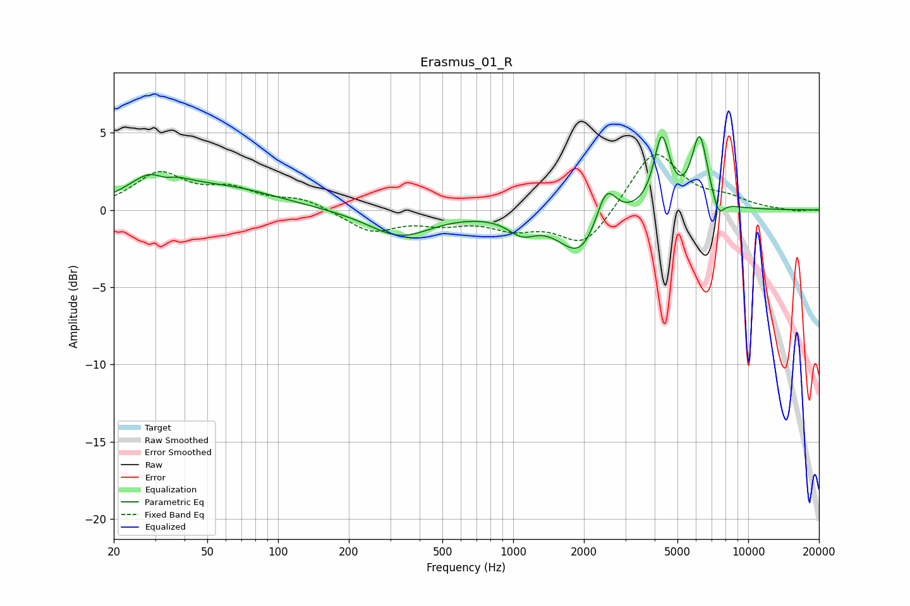

# Erasmus_01_R
See [usage instructions](https://github.com/jaakkopasanen/AutoEq#usage) for more options and info.

### Parametric EQs
Apply preamp of -4.8 dB when using parametric equalizer.

|   # | Type    |   Fc (Hz) |    Q |   Gain (dB) |
|-----|---------|-----------|------|-------------|
|   1 | Peaking |        30 | 1.4  |         2.2 |
|   2 | Peaking |        33 | 3.2  |        -0.7 |
|   3 | Peaking |        61 | 0.64 |         1.3 |
|   4 | Peaking |       330 | 1.05 |        -1.7 |
|   5 | Peaking |      1089 | 2.38 |        -1.1 |
|   6 | Peaking |      1931 | 1.58 |        -3   |
|   7 | Peaking |      2485 | 3.29 |         2.6 |
|   8 | Peaking |      4287 | 4.22 |         4.6 |
|   9 | Peaking |      6213 | 4.08 |         4.7 |
|  10 | Peaking |      7473 | 5.63 |        -1.2 |

### Fixed Band EQs
When using fixed band (also called graphic) equalizer, apply preamp of **-3.7 dB** (if available) and set gains manually with these parameters.

|   # | Type    |   Fc (Hz) |    Q |   Gain (dB) |
|-----|---------|-----------|------|-------------|
|   1 | Peaking |        31 | 1.41 |         2.3 |
|   2 | Peaking |        62 | 1.41 |         1.1 |
|   3 | Peaking |       125 | 1.41 |         0.7 |
|   4 | Peaking |       250 | 1.41 |        -1.4 |
|   5 | Peaking |       500 | 1.41 |        -0.7 |
|   6 | Peaking |      1000 | 1.41 |        -1   |
|   7 | Peaking |      2000 | 1.41 |        -2.4 |
|   8 | Peaking |      4000 | 1.41 |         3.9 |
|   9 | Peaking |      8000 | 1.41 |         0.6 |
|  10 | Peaking |     16000 | 1.41 |        -0.1 |

### Graphs

