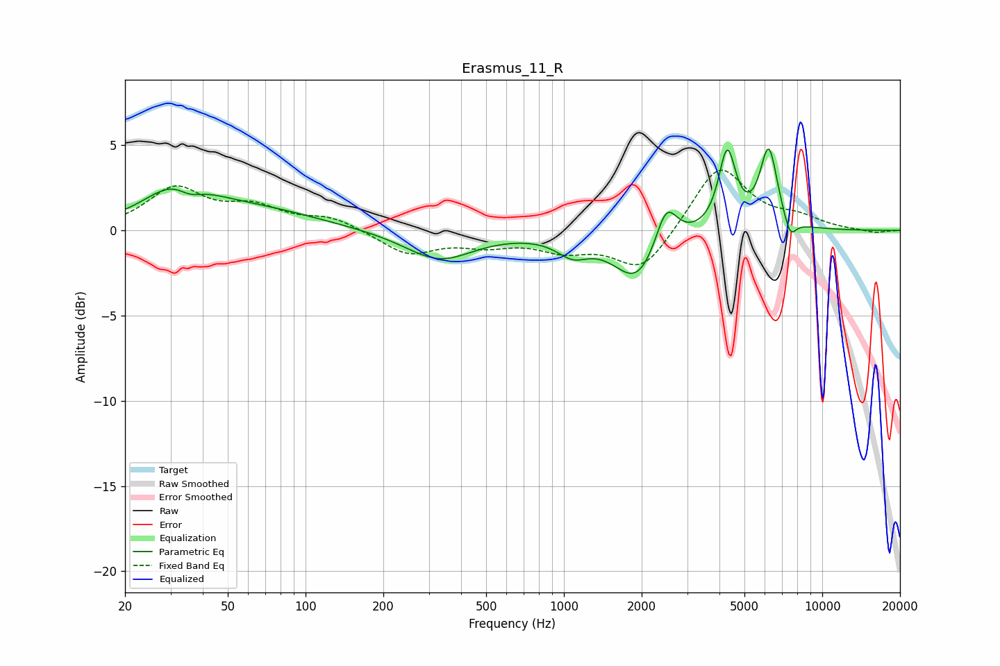

# Erasmus_11_R
See [usage instructions](https://github.com/jaakkopasanen/AutoEq#usage) for more options and info.

### Parametric EQs
Apply preamp of -4.9 dB when using parametric equalizer.

|   # | Type    |   Fc (Hz) |    Q |   Gain (dB) |
|-----|---------|-----------|------|-------------|
|   1 | Peaking |        32 | 1.16 |         2.3 |
|   2 | Peaking |        36 | 2.79 |        -0.8 |
|   3 | Peaking |        64 | 0.58 |         1.1 |
|   4 | Peaking |       329 | 1.06 |        -1.7 |
|   5 | Peaking |      1081 | 2.29 |        -1   |
|   6 | Peaking |      1927 | 1.58 |        -3   |
|   7 | Peaking |      2487 | 3.31 |         2.6 |
|   8 | Peaking |      4288 | 4.26 |         4.5 |
|   9 | Peaking |      6208 | 4.02 |         4.7 |
|  10 | Peaking |      7505 | 5.6  |        -1.2 |

### Fixed Band EQs
When using fixed band (also called graphic) equalizer, apply preamp of **-3.6 dB** (if available) and set gains manually with these parameters.

|   # | Type    |   Fc (Hz) |    Q |   Gain (dB) |
|-----|---------|-----------|------|-------------|
|   1 | Peaking |        31 | 1.41 |         2.4 |
|   2 | Peaking |        62 | 1.41 |         1.2 |
|   3 | Peaking |       125 | 1.41 |         0.7 |
|   4 | Peaking |       250 | 1.41 |        -1.4 |
|   5 | Peaking |       500 | 1.41 |        -0.7 |
|   6 | Peaking |      1000 | 1.41 |        -1   |
|   7 | Peaking |      2000 | 1.41 |        -2.4 |
|   8 | Peaking |      4000 | 1.41 |         3.9 |
|   9 | Peaking |      8000 | 1.41 |         0.6 |
|  10 | Peaking |     16000 | 1.41 |        -0.2 |

### Graphs

