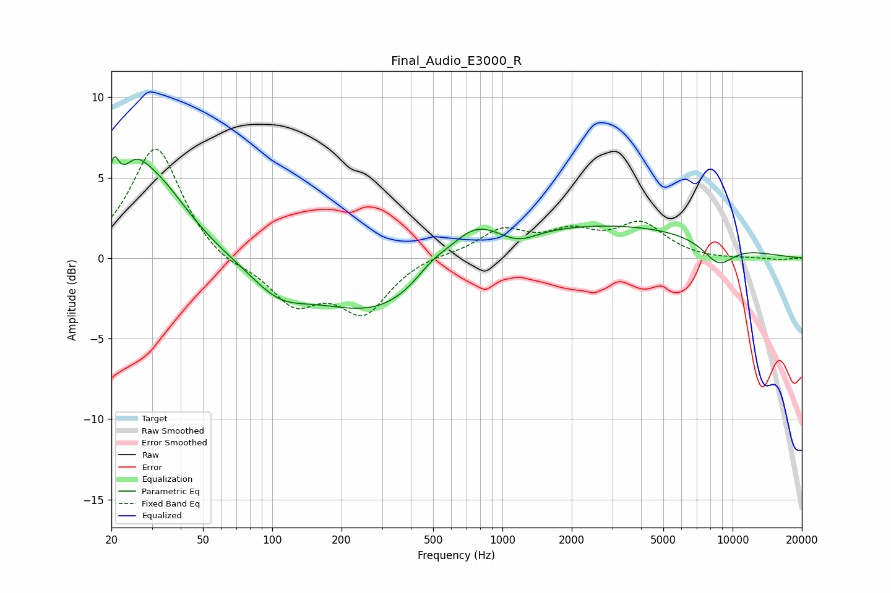

# Final_Audio_E3000_R
See [usage instructions](https://github.com/jaakkopasanen/AutoEq#usage) for more options and info.

### Parametric EQs
Apply preamp of -6.4 dB when using parametric equalizer.

|   # | Type    |   Fc (Hz) |    Q |   Gain (dB) |
|-----|---------|-----------|------|-------------|
|   1 | Peaking |        20 | 6    |         2.6 |
|   2 | Peaking |        25 | 2.38 |         2   |
|   3 | Peaking |        31 | 0.95 |         4.6 |
|   4 | Peaking |       107 | 1.15 |        -1.6 |
|   5 | Peaking |       301 | 0.49 |        -3.6 |
|   6 | Peaking |       492 | 1.81 |         0.9 |
|   7 | Peaking |       747 | 1.24 |         2   |
|   8 | Peaking |      1169 | 1.78 |        -0.7 |
|   9 | Peaking |      2448 | 0.24 |         2.2 |
|  10 | Peaking |      8672 | 1.92 |        -1.4 |

### Fixed Band EQs
When using fixed band (also called graphic) equalizer, apply preamp of **-6.9 dB** (if available) and set gains manually with these parameters.

|   # | Type    |   Fc (Hz) |    Q |   Gain (dB) |
|-----|---------|-----------|------|-------------|
|   1 | Peaking |        31 | 1.41 |         7   |
|   2 | Peaking |        62 | 1.41 |        -0.6 |
|   3 | Peaking |       125 | 1.41 |        -2.7 |
|   4 | Peaking |       250 | 1.41 |        -3.2 |
|   5 | Peaking |       500 | 1.41 |         0.2 |
|   6 | Peaking |      1000 | 1.41 |         1.6 |
|   7 | Peaking |      2000 | 1.41 |         1.4 |
|   8 | Peaking |      4000 | 1.41 |         2   |
|   9 | Peaking |      8000 | 1.41 |        -0.1 |
|  10 | Peaking |     16000 | 1.41 |        -0.1 |

### Graphs

