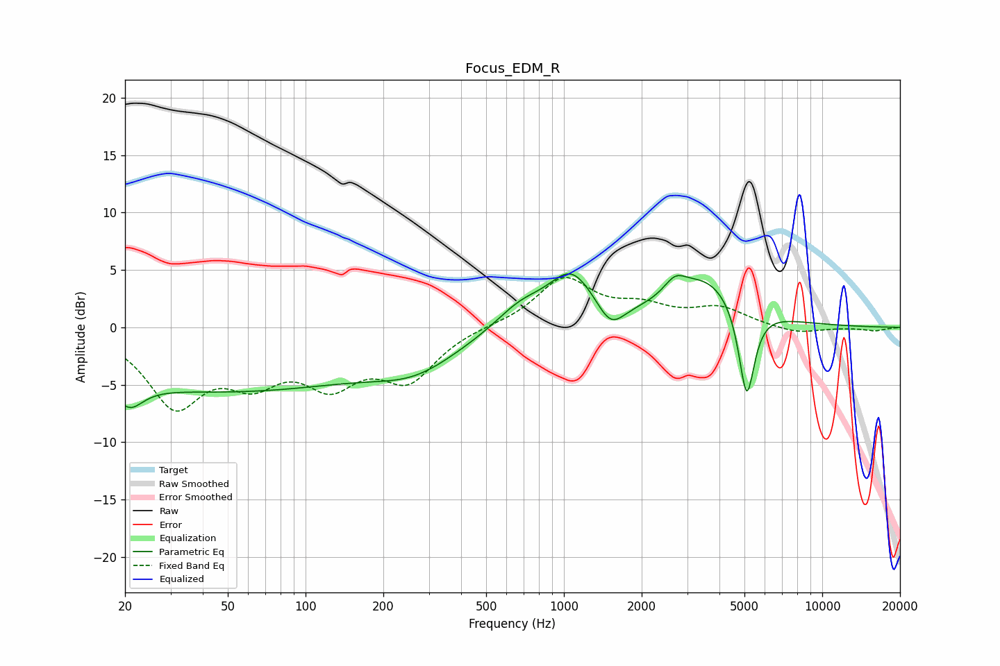

# Focus_EDM_R
See [usage instructions](https://github.com/jaakkopasanen/AutoEq#usage) for more options and info.

### Parametric EQs
Apply preamp of -4.8 dB when using parametric equalizer.

|   # | Type    |   Fc (Hz) |    Q |   Gain (dB) |
|-----|---------|-----------|------|-------------|
|   1 | Peaking |        20 | 3.66 |         3.2 |
|   2 | Peaking |        20 | 2.98 |        -5.5 |
|   3 | Peaking |        48 | 0.22 |        -5.4 |
|   4 | Peaking |       268 | 0.84 |        -2.3 |
|   5 | Peaking |       678 | 1.43 |         1.9 |
|   6 | Peaking |      1069 | 1.56 |         4.4 |
|   7 | Peaking |      1517 | 2.72 |        -2.2 |
|   8 | Peaking |      2690 | 3.35 |         1.4 |
|   9 | Peaking |      3572 | 0.98 |         4.2 |
|  10 | Peaking |      5100 | 4.51 |        -8.3 |

### Fixed Band EQs
When using fixed band (also called graphic) equalizer, apply preamp of **-4.4 dB** (if available) and set gains manually with these parameters.

|   # | Type    |   Fc (Hz) |    Q |   Gain (dB) |
|-----|---------|-----------|------|-------------|
|   1 | Peaking |        31 | 1.41 |        -6.4 |
|   2 | Peaking |        62 | 1.41 |        -3.7 |
|   3 | Peaking |       125 | 1.41 |        -4.2 |
|   4 | Peaking |       250 | 1.41 |        -4.2 |
|   5 | Peaking |       500 | 1.41 |         0.1 |
|   6 | Peaking |      1000 | 1.41 |         4.2 |
|   7 | Peaking |      2000 | 1.41 |         1.5 |
|   8 | Peaking |      4000 | 1.41 |         1.6 |
|   9 | Peaking |      8000 | 1.41 |        -0.6 |
|  10 | Peaking |     16000 | 1.41 |        -0.3 |

### Graphs

