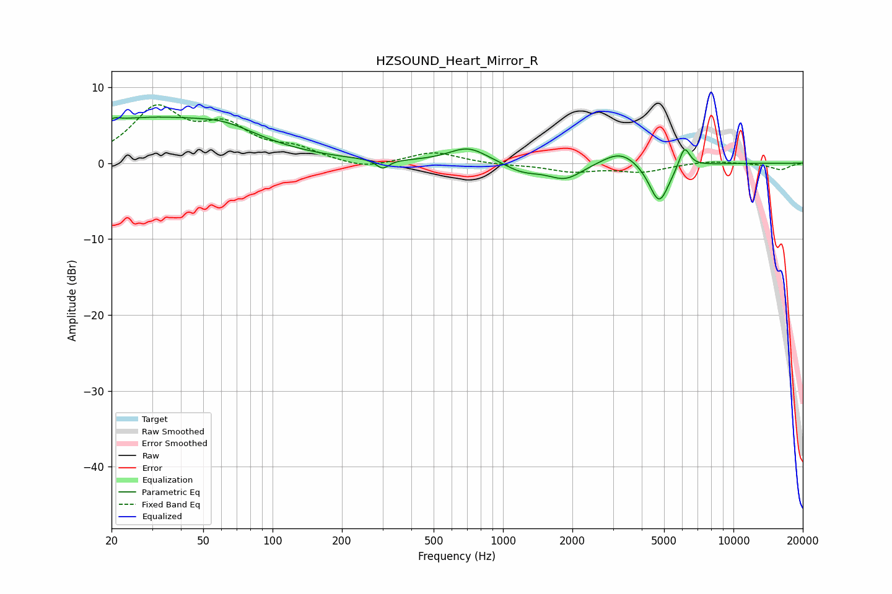

# HZSOUND_Heart_Mirror_R
See [usage instructions](https://github.com/jaakkopasanen/AutoEq#usage) for more options and info.

### Parametric EQs
Apply preamp of -6.2 dB when using parametric equalizer.

|   # | Type    |   Fc (Hz) |    Q |   Gain (dB) |
|-----|---------|-----------|------|-------------|
|   1 | Peaking |        21 | 5.98 |         0.4 |
|   2 | Peaking |        28 | 0.36 |         5.7 |
|   3 | Peaking |        63 | 1.09 |         1.4 |
|   4 | Peaking |       300 | 5.15 |        -1.2 |
|   5 | Peaking |       706 | 1.64 |         2.1 |
|   6 | Peaking |      1213 | 1.82 |        -1.2 |
|   7 | Peaking |      1864 | 1.86 |        -2.1 |
|   8 | Peaking |      3241 | 1.76 |         2   |
|   9 | Peaking |      4759 | 3.16 |        -5.5 |
|  10 | Peaking |      6125 | 5.8  |         2.9 |

### Fixed Band EQs
When using fixed band (also called graphic) equalizer, apply preamp of **-7.8 dB** (if available) and set gains manually with these parameters.

|   # | Type    |   Fc (Hz) |    Q |   Gain (dB) |
|-----|---------|-----------|------|-------------|
|   1 | Peaking |        31 | 1.41 |         6.8 |
|   2 | Peaking |        62 | 1.41 |         4.2 |
|   3 | Peaking |       125 | 1.41 |         1.6 |
|   4 | Peaking |       250 | 1.41 |        -0.9 |
|   5 | Peaking |       500 | 1.41 |         1.5 |
|   6 | Peaking |      1000 | 1.41 |        -0.2 |
|   7 | Peaking |      2000 | 1.41 |        -1   |
|   8 | Peaking |      4000 | 1.41 |        -1.1 |
|   9 | Peaking |      8000 | 1.41 |         0.4 |
|  10 | Peaking |     16000 | 1.41 |        -0.9 |

### Graphs

