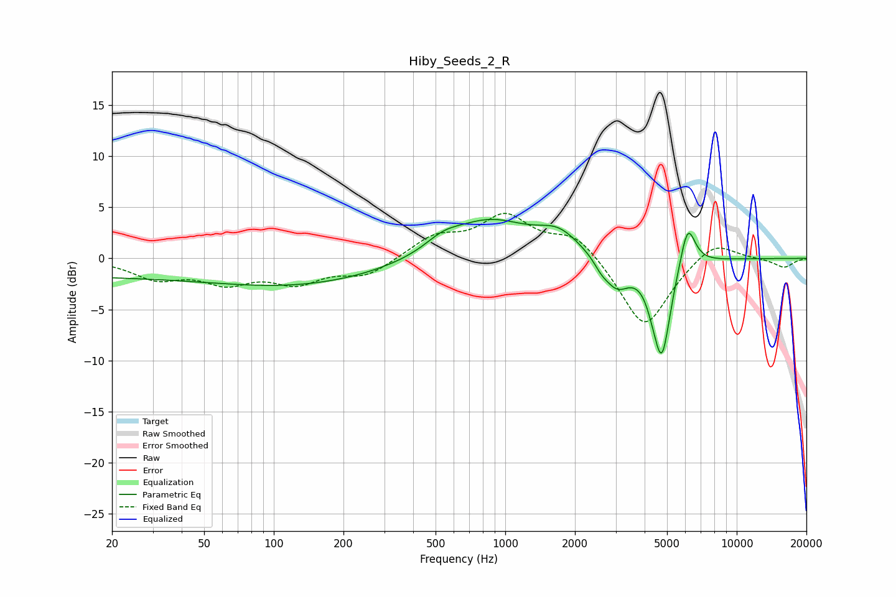

# Hiby_Seeds_2_R
See [usage instructions](https://github.com/jaakkopasanen/AutoEq#usage) for more options and info.

### Parametric EQs
Apply preamp of -3.9 dB when using parametric equalizer.

|   # | Type    |   Fc (Hz) |    Q |   Gain (dB) |
|-----|---------|-----------|------|-------------|
|   1 | Peaking |        20 | 0.18 |        -1.7 |
|   2 | Peaking |       155 | 0.4  |        -2   |
|   3 | Peaking |       538 | 1.87 |         1   |
|   4 | Peaking |       848 | 0.8  |         3.7 |
|   5 | Peaking |      1701 | 1.58 |         2   |
|   6 | Peaking |      2597 | 4.65 |        -0.7 |
|   7 | Peaking |      3031 | 2.49 |        -2.9 |
|   8 | Peaking |      4346 | 4.74 |        -0.9 |
|   9 | Peaking |      4750 | 3.6  |        -9.3 |
|  10 | Peaking |      6138 | 4.18 |         4.4 |

### Fixed Band EQs
When using fixed band (also called graphic) equalizer, apply preamp of **-4.5 dB** (if available) and set gains manually with these parameters.

|   # | Type    |   Fc (Hz) |    Q |   Gain (dB) |
|-----|---------|-----------|------|-------------|
|   1 | Peaking |        31 | 1.41 |        -1.8 |
|   2 | Peaking |        62 | 1.41 |        -2.1 |
|   3 | Peaking |       125 | 1.41 |        -2.1 |
|   4 | Peaking |       250 | 1.41 |        -1.6 |
|   5 | Peaking |       500 | 1.41 |         2   |
|   6 | Peaking |      1000 | 1.41 |         3.9 |
|   7 | Peaking |      2000 | 1.41 |         2.4 |
|   8 | Peaking |      4000 | 1.41 |        -7   |
|   9 | Peaking |      8000 | 1.41 |         1.9 |
|  10 | Peaking |     16000 | 1.41 |        -0.9 |

### Graphs

