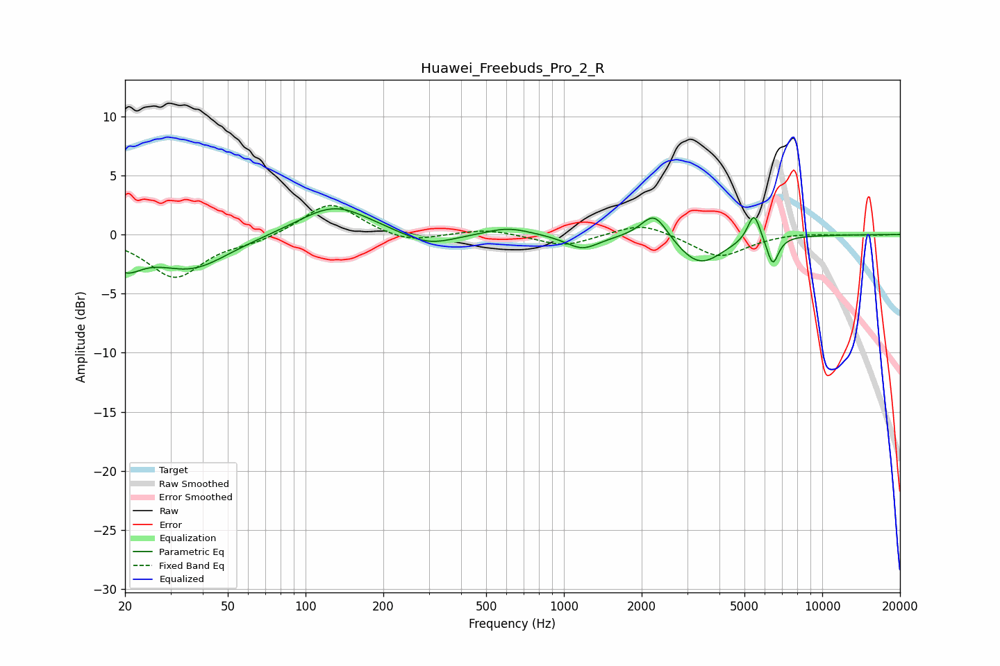

# Huawei_Freebuds_Pro_2_R
See [usage instructions](https://github.com/jaakkopasanen/AutoEq#usage) for more options and info.

### Parametric EQs
Apply preamp of -2.3 dB when using parametric equalizer.

|   # | Type    |   Fc (Hz) |    Q |   Gain (dB) |
|-----|---------|-----------|------|-------------|
|   1 | Peaking |        20 | 2.22 |        -2.1 |
|   2 | Peaking |        36 | 0.97 |        -2.8 |
|   3 | Peaking |       129 | 1.03 |         2.6 |
|   4 | Peaking |       299 | 1.38 |        -1.1 |
|   5 | Peaking |       607 | 1.63 |         0.7 |
|   6 | Peaking |      1179 | 2.19 |        -1.2 |
|   7 | Peaking |      2239 | 2.75 |         2.4 |
|   8 | Peaking |      3355 | 1.58 |        -2.6 |
|   9 | Peaking |      5443 | 5.66 |         2.4 |
|  10 | Peaking |      6429 | 6    |        -2.4 |

### Fixed Band EQs
When using fixed band (also called graphic) equalizer, apply preamp of **-2.6 dB** (if available) and set gains manually with these parameters.

|   # | Type    |   Fc (Hz) |    Q |   Gain (dB) |
|-----|---------|-----------|------|-------------|
|   1 | Peaking |        31 | 1.41 |        -3.6 |
|   2 | Peaking |        62 | 1.41 |        -0.6 |
|   3 | Peaking |       125 | 1.41 |         2.8 |
|   4 | Peaking |       250 | 1.41 |        -0.8 |
|   5 | Peaking |       500 | 1.41 |         0.5 |
|   6 | Peaking |      1000 | 1.41 |        -1   |
|   7 | Peaking |      2000 | 1.41 |         1.1 |
|   8 | Peaking |      4000 | 1.41 |        -2   |
|   9 | Peaking |      8000 | 1.41 |         0.2 |
|  10 | Peaking |     16000 | 1.41 |        -0   |

### Graphs

