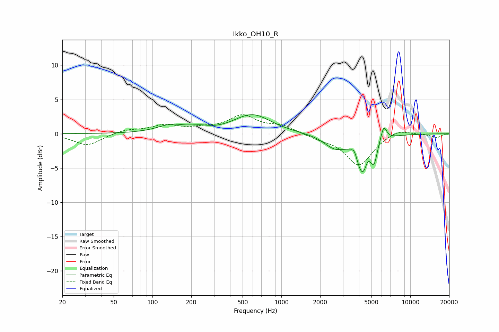

# Ikko_OH10_R
See [usage instructions](https://github.com/jaakkopasanen/AutoEq#usage) for more options and info.

### Parametric EQs
Apply preamp of -2.9 dB when using parametric equalizer.

|   # | Type    |   Fc (Hz) |    Q |   Gain (dB) |
|-----|---------|-----------|------|-------------|
|   1 | Peaking |       140 | 1.3  |         1.1 |
|   2 | Peaking |       232 | 1.93 |         0.5 |
|   3 | Peaking |       308 | 1.94 |        -0.1 |
|   4 | Peaking |       596 | 0.99 |         2.8 |
|   5 | Peaking |      2586 | 1.67 |        -1.8 |
|   6 | Peaking |      3675 | 6    |         1.3 |
|   7 | Peaking |      4293 | 2.62 |        -5.9 |
|   8 | Peaking |      4652 | 6    |         1.4 |
|   9 | Peaking |      5233 | 6    |        -2.5 |
|  10 | Peaking |      6225 | 5.95 |         2.2 |

### Fixed Band EQs
When using fixed band (also called graphic) equalizer, apply preamp of **-2.9 dB** (if available) and set gains manually with these parameters.

|   # | Type    |   Fc (Hz) |    Q |   Gain (dB) |
|-----|---------|-----------|------|-------------|
|   1 | Peaking |        31 | 1.41 |        -1.7 |
|   2 | Peaking |        62 | 1.41 |         0.6 |
|   3 | Peaking |       125 | 1.41 |         1.1 |
|   4 | Peaking |       250 | 1.41 |         0.6 |
|   5 | Peaking |       500 | 1.41 |         2.5 |
|   6 | Peaking |      1000 | 1.41 |         1.1 |
|   7 | Peaking |      2000 | 1.41 |        -0.5 |
|   8 | Peaking |      4000 | 1.41 |        -4.6 |
|   9 | Peaking |      8000 | 1.41 |         0.8 |
|  10 | Peaking |     16000 | 1.41 |        -0.5 |

### Graphs

