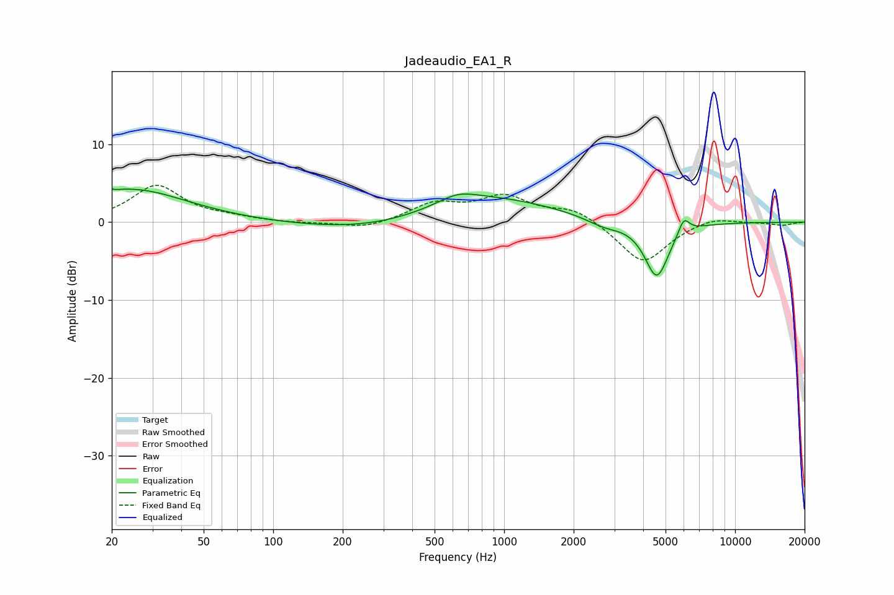

# Jadeaudio_EA1_R
See [usage instructions](https://github.com/jaakkopasanen/AutoEq#usage) for more options and info.

### Parametric EQs
Apply preamp of -4.4 dB when using parametric equalizer.

|   # | Type    |   Fc (Hz) |    Q |   Gain (dB) |
|-----|---------|-----------|------|-------------|
|   1 | Peaking |        20 | 5.79 |         3.2 |
|   2 | Peaking |        20 | 6    |        -3   |
|   3 | Peaking |        24 | 0.57 |         4   |
|   4 | Peaking |        27 | 0.92 |         0.2 |
|   5 | Peaking |       309 | 0.45 |        -1.7 |
|   6 | Peaking |       628 | 1.71 |         1.2 |
|   7 | Peaking |       783 | 0.47 |         3.6 |
|   8 | Peaking |      2697 | 1.83 |        -1   |
|   9 | Peaking |      4580 | 2.63 |        -7.2 |
|  10 | Peaking |      5997 | 5.72 |         2.1 |

### Fixed Band EQs
When using fixed band (also called graphic) equalizer, apply preamp of **-4.8 dB** (if available) and set gains manually with these parameters.

|   # | Type    |   Fc (Hz) |    Q |   Gain (dB) |
|-----|---------|-----------|------|-------------|
|   1 | Peaking |        31 | 1.41 |         4.6 |
|   2 | Peaking |        62 | 1.41 |         0.5 |
|   3 | Peaking |       125 | 1.41 |        -0.2 |
|   4 | Peaking |       250 | 1.41 |        -0.9 |
|   5 | Peaking |       500 | 1.41 |         2.2 |
|   6 | Peaking |      1000 | 1.41 |         3.1 |
|   7 | Peaking |      2000 | 1.41 |         1.7 |
|   8 | Peaking |      4000 | 1.41 |        -5.4 |
|   9 | Peaking |      8000 | 1.41 |         0.8 |
|  10 | Peaking |     16000 | 1.41 |        -0.4 |

### Graphs

