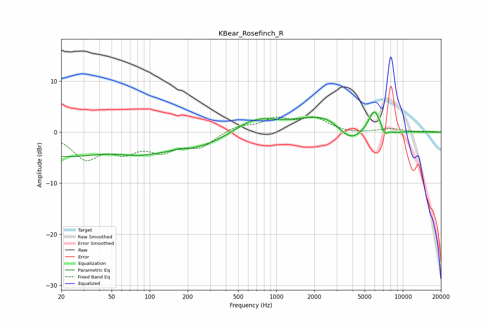

# KBear_Rosefinch_R
See [usage instructions](https://github.com/jaakkopasanen/AutoEq#usage) for more options and info.

### Parametric EQs
Apply preamp of -4.1 dB when using parametric equalizer.

|   # | Type    |   Fc (Hz) |    Q |   Gain (dB) |
|-----|---------|-----------|------|-------------|
|   1 | Peaking |        20 | 0.38 |        -4.5 |
|   2 | Peaking |        80 | 1.09 |        -1.1 |
|   3 | Peaking |       166 | 3.05 |         0.4 |
|   4 | Peaking |       194 | 0.4  |        -3.4 |
|   5 | Peaking |       671 | 0.81 |         3.2 |
|   6 | Peaking |      2453 | 0.68 |         3.5 |
|   7 | Peaking |      3821 | 1.42 |        -3.6 |
|   8 | Peaking |      5934 | 3.19 |         4.3 |
|   9 | Peaking |      7204 | 5.73 |        -1.4 |
|  10 | Peaking |      8652 | 2.38 |        -0.4 |

### Fixed Band EQs
When using fixed band (also called graphic) equalizer, apply preamp of **-3.1 dB** (if available) and set gains manually with these parameters.

|   # | Type    |   Fc (Hz) |    Q |   Gain (dB) |
|-----|---------|-----------|------|-------------|
|   1 | Peaking |        31 | 1.41 |        -4.9 |
|   2 | Peaking |        62 | 1.41 |        -3.2 |
|   3 | Peaking |       125 | 1.41 |        -3.2 |
|   4 | Peaking |       250 | 1.41 |        -2.7 |
|   5 | Peaking |       500 | 1.41 |         1.2 |
|   6 | Peaking |      1000 | 1.41 |         2.4 |
|   7 | Peaking |      2000 | 1.41 |         2.6 |
|   8 | Peaking |      4000 | 1.41 |        -0.3 |
|   9 | Peaking |      8000 | 1.41 |         0.7 |
|  10 | Peaking |     16000 | 1.41 |         0.2 |

### Graphs

