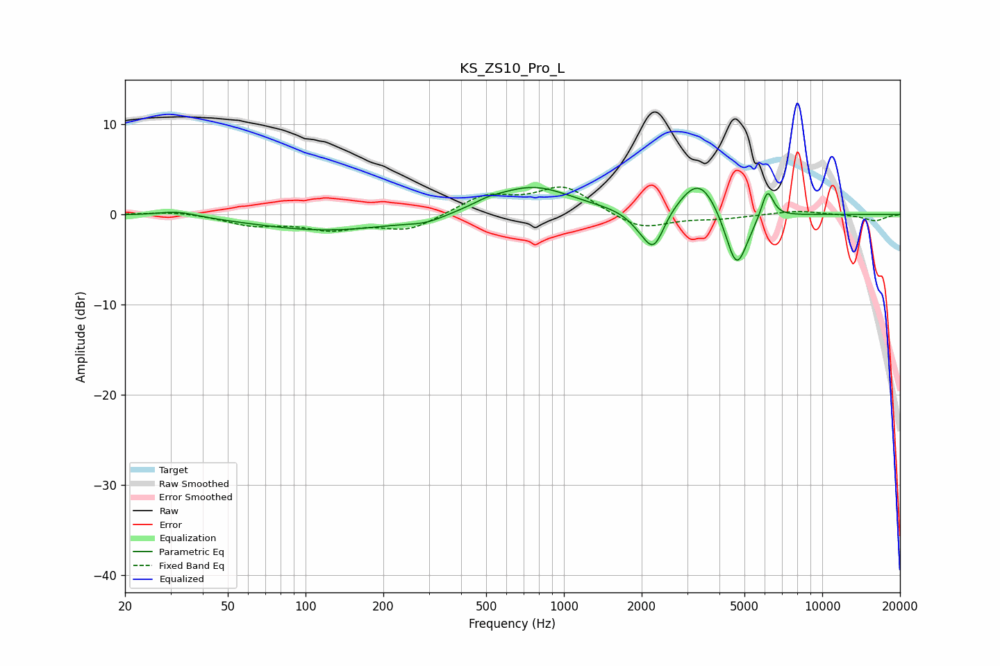

# KS_ZS10_Pro_L
See [usage instructions](https://github.com/jaakkopasanen/AutoEq#usage) for more options and info.

### Parametric EQs
Apply preamp of -3.1 dB when using parametric equalizer.

|   # | Type    |   Fc (Hz) |    Q |   Gain (dB) |
|-----|---------|-----------|------|-------------|
|   1 | Peaking |        32 | 1.78 |         0.6 |
|   2 | Peaking |       123 | 0.5  |        -1.8 |
|   3 | Peaking |       294 | 1.88 |        -0.6 |
|   4 | Peaking |       506 | 2.83 |         0.4 |
|   5 | Peaking |       748 | 0.9  |         3.2 |
|   6 | Peaking |      1988 | 2.81 |        -1.2 |
|   7 | Peaking |      2233 | 3.51 |        -3.9 |
|   8 | Peaking |      3351 | 1.82 |         4.4 |
|   9 | Peaking |      4658 | 3.13 |        -6.9 |
|  10 | Peaking |      6133 | 5.87 |         3.3 |

### Fixed Band EQs
When using fixed band (also called graphic) equalizer, apply preamp of **-3.1 dB** (if available) and set gains manually with these parameters.

|   # | Type    |   Fc (Hz) |    Q |   Gain (dB) |
|-----|---------|-----------|------|-------------|
|   1 | Peaking |        31 | 1.41 |         0.4 |
|   2 | Peaking |        62 | 1.41 |        -1.1 |
|   3 | Peaking |       125 | 1.41 |        -1.5 |
|   4 | Peaking |       250 | 1.41 |        -1.7 |
|   5 | Peaking |       500 | 1.41 |         2   |
|   6 | Peaking |      1000 | 1.41 |         3   |
|   7 | Peaking |      2000 | 1.41 |        -1.7 |
|   8 | Peaking |      4000 | 1.41 |        -0.4 |
|   9 | Peaking |      8000 | 1.41 |         0.4 |
|  10 | Peaking |     16000 | 1.41 |        -0.7 |

### Graphs

