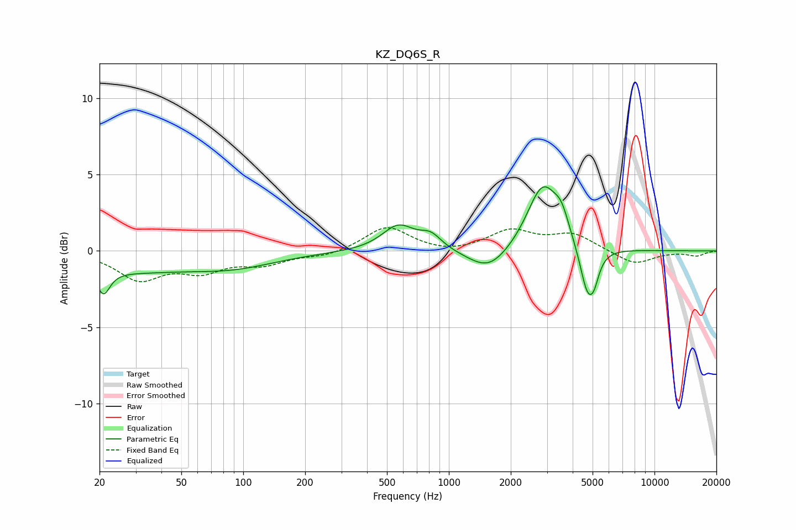

# KZ_DQ6S_R
See [usage instructions](https://github.com/jaakkopasanen/AutoEq#usage) for more options and info.

### Parametric EQs
Apply preamp of -4.3 dB when using parametric equalizer.

|   # | Type    |   Fc (Hz) |    Q |   Gain (dB) |
|-----|---------|-----------|------|-------------|
|   1 | Peaking |        21 | 4.55 |        -1.6 |
|   2 | Peaking |        27 | 0.48 |        -1.2 |
|   3 | Peaking |        90 | 0.65 |        -0.9 |
|   4 | Peaking |       568 | 1.78 |         1.7 |
|   5 | Peaking |       817 | 2.7  |         0.9 |
|   6 | Peaking |      1563 | 1.42 |        -1.5 |
|   7 | Peaking |      2866 | 1.84 |         4.4 |
|   8 | Peaking |      3535 | 3.89 |         1.3 |
|   9 | Peaking |      4729 | 3.72 |        -3.2 |
|  10 | Peaking |      5091 | 6    |        -1   |

### Fixed Band EQs
When using fixed band (also called graphic) equalizer, apply preamp of **-1.6 dB** (if available) and set gains manually with these parameters.

|   # | Type    |   Fc (Hz) |    Q |   Gain (dB) |
|-----|---------|-----------|------|-------------|
|   1 | Peaking |        31 | 1.41 |        -1.8 |
|   2 | Peaking |        62 | 1.41 |        -1.2 |
|   3 | Peaking |       125 | 1.41 |        -0.8 |
|   4 | Peaking |       250 | 1.41 |        -0.3 |
|   5 | Peaking |       500 | 1.41 |         1.6 |
|   6 | Peaking |      1000 | 1.41 |        -0.2 |
|   7 | Peaking |      2000 | 1.41 |         1.3 |
|   8 | Peaking |      4000 | 1.41 |         1.1 |
|   9 | Peaking |      8000 | 1.41 |        -0.9 |
|  10 | Peaking |     16000 | 1.41 |        -0.3 |

### Graphs

