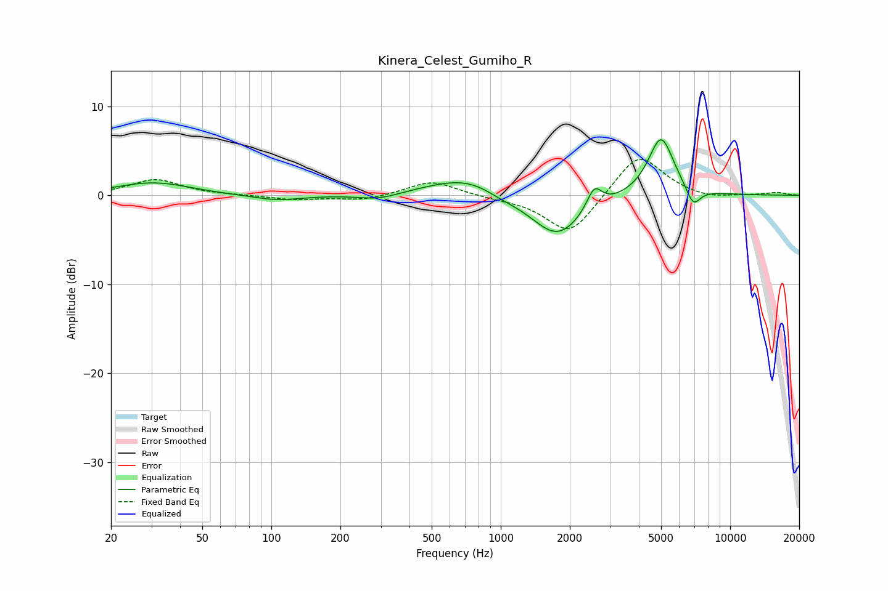

# Kinera_Celest_Gumiho_R
See [usage instructions](https://github.com/jaakkopasanen/AutoEq#usage) for more options and info.

### Parametric EQs
Apply preamp of -6.3 dB when using parametric equalizer.

|   # | Type    |   Fc (Hz) |    Q |   Gain (dB) |
|-----|---------|-----------|------|-------------|
|   1 | Peaking |        28 | 0.96 |         1   |
|   2 | Peaking |        37 | 1.08 |         0.5 |
|   3 | Peaking |       106 | 1.31 |        -0.6 |
|   4 | Peaking |       294 | 1.54 |        -0.7 |
|   5 | Peaking |       742 | 0.8  |         2.4 |
|   6 | Peaking |      1009 | 1.62 |        -0.8 |
|   7 | Peaking |      1759 | 1.22 |        -4.9 |
|   8 | Peaking |      2556 | 4.27 |         2.5 |
|   9 | Peaking |      4998 | 2.45 |         6.8 |
|  10 | Peaking |      6904 | 4.32 |        -2.2 |

### Fixed Band EQs
When using fixed band (also called graphic) equalizer, apply preamp of **-4.1 dB** (if available) and set gains manually with these parameters.

|   # | Type    |   Fc (Hz) |    Q |   Gain (dB) |
|-----|---------|-----------|------|-------------|
|   1 | Peaking |        31 | 1.41 |         1.8 |
|   2 | Peaking |        62 | 1.41 |         0   |
|   3 | Peaking |       125 | 1.41 |        -0.5 |
|   4 | Peaking |       250 | 1.41 |        -0.6 |
|   5 | Peaking |       500 | 1.41 |         1.7 |
|   6 | Peaking |      1000 | 1.41 |        -0.3 |
|   7 | Peaking |      2000 | 1.41 |        -4.5 |
|   8 | Peaking |      4000 | 1.41 |         4.9 |
|   9 | Peaking |      8000 | 1.41 |        -0.5 |
|  10 | Peaking |     16000 | 1.41 |         0.3 |

### Graphs

