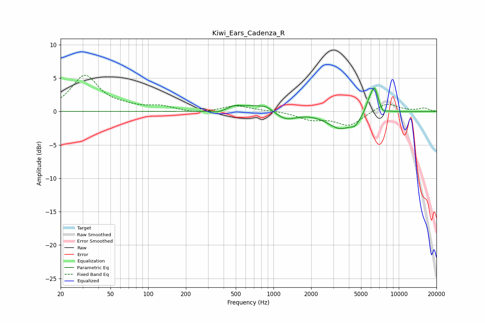

# Kiwi_Ears_Cadenza_R
See [usage instructions](https://github.com/jaakkopasanen/AutoEq#usage) for more options and info.

### Parametric EQs
Apply preamp of -3.6 dB when using parametric equalizer.

|   # | Type    |   Fc (Hz) |    Q |   Gain (dB) |
|-----|---------|-----------|------|-------------|
|   1 | Peaking |       361 | 2.84 |        -0.3 |
|   2 | Peaking |       491 | 2.51 |         0.6 |
|   3 | Peaking |       748 | 1.29 |         1   |
|   4 | Peaking |       888 | 4.29 |         0.3 |
|   5 | Peaking |      1259 | 1.79 |        -1.2 |
|   6 | Peaking |      3414 | 1.38 |        -2.5 |
|   7 | Peaking |      4481 | 3.92 |        -1   |
|   8 | Peaking |      5720 | 6    |         0.9 |
|   9 | Peaking |      6374 | 4.37 |         3.9 |
|  10 | Peaking |      7470 | 6    |        -0.6 |

### Fixed Band EQs
When using fixed band (also called graphic) equalizer, apply preamp of **-5.5 dB** (if available) and set gains manually with these parameters.

|   # | Type    |   Fc (Hz) |    Q |   Gain (dB) |
|-----|---------|-----------|------|-------------|
|   1 | Peaking |        31 | 1.41 |         5.3 |
|   2 | Peaking |        62 | 1.41 |         0.5 |
|   3 | Peaking |       125 | 1.41 |         0.7 |
|   4 | Peaking |       250 | 1.41 |        -0.4 |
|   5 | Peaking |       500 | 1.41 |         0.9 |
|   6 | Peaking |      1000 | 1.41 |         0.1 |
|   7 | Peaking |      2000 | 1.41 |        -1.1 |
|   8 | Peaking |      4000 | 1.41 |        -2.1 |
|   9 | Peaking |      8000 | 1.41 |         1.3 |
|  10 | Peaking |     16000 | 1.41 |         0.5 |

### Graphs

