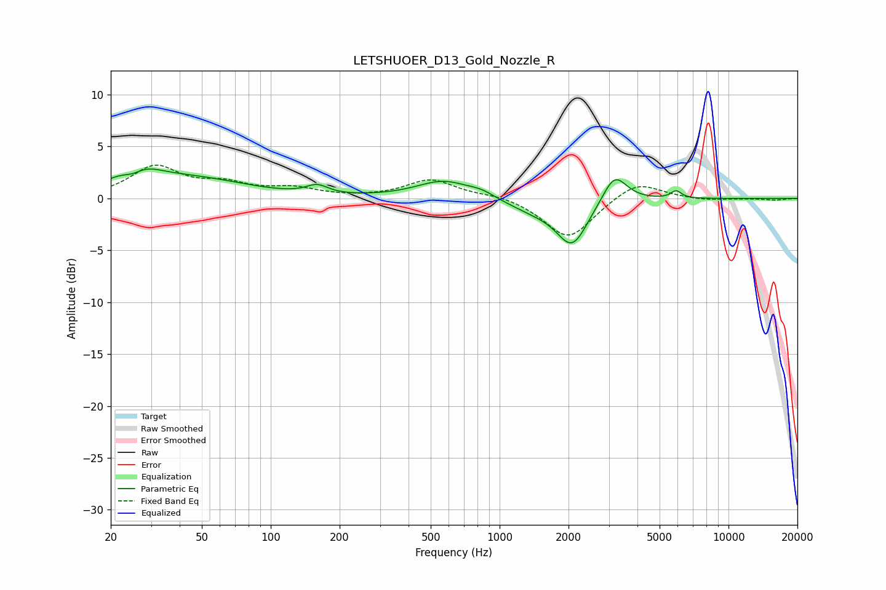

# LETSHUOER_D13_Gold_Nozzle_R
See [usage instructions](https://github.com/jaakkopasanen/AutoEq#usage) for more options and info.

### Parametric EQs
Apply preamp of -2.9 dB when using parametric equalizer.

|   # | Type    |   Fc (Hz) |    Q |   Gain (dB) |
|-----|---------|-----------|------|-------------|
|   1 | Peaking |        25 | 2.77 |        -1.3 |
|   2 | Peaking |        26 | 1.53 |         2.7 |
|   3 | Peaking |        47 | 0.61 |         1.7 |
|   4 | Peaking |       160 | 3.03 |         0.8 |
|   5 | Peaking |       569 | 1.19 |         1.7 |
|   6 | Peaking |       835 | 2.39 |         0.5 |
|   7 | Peaking |      1402 | 1.15 |        -1   |
|   8 | Peaking |      2077 | 2.08 |        -4.3 |
|   9 | Peaking |      3179 | 2.67 |         2.9 |
|  10 | Peaking |      5906 | 6    |         0.7 |

### Fixed Band EQs
When using fixed band (also called graphic) equalizer, apply preamp of **-3.3 dB** (if available) and set gains manually with these parameters.

|   # | Type    |   Fc (Hz) |    Q |   Gain (dB) |
|-----|---------|-----------|------|-------------|
|   1 | Peaking |        31 | 1.41 |         3   |
|   2 | Peaking |        62 | 1.41 |         1.2 |
|   3 | Peaking |       125 | 1.41 |         0.8 |
|   4 | Peaking |       250 | 1.41 |         0   |
|   5 | Peaking |       500 | 1.41 |         1.8 |
|   6 | Peaking |      1000 | 1.41 |         0.4 |
|   7 | Peaking |      2000 | 1.41 |        -4   |
|   8 | Peaking |      4000 | 1.41 |         1.8 |
|   9 | Peaking |      8000 | 1.41 |        -0.2 |
|  10 | Peaking |     16000 | 1.41 |        -0.2 |

### Graphs

