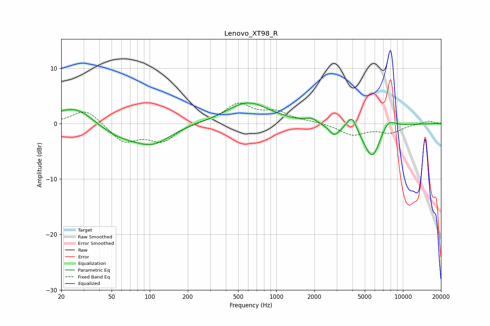

# Lenovo_XT98_R
See [usage instructions](https://github.com/jaakkopasanen/AutoEq#usage) for more options and info.

### Parametric EQs
Apply preamp of -3.8 dB when using parametric equalizer.

|   # | Type    |   Fc (Hz) |    Q |   Gain (dB) |
|-----|---------|-----------|------|-------------|
|   1 | Peaking |        20 | 2.6  |         0.4 |
|   2 | Peaking |        26 | 1.06 |         3.1 |
|   3 | Peaking |        57 | 0.89 |        -2   |
|   4 | Peaking |       106 | 0.99 |        -3.2 |
|   5 | Peaking |       599 | 0.84 |         3.8 |
|   6 | Peaking |      1891 | 3.49 |         0.7 |
|   7 | Peaking |      2880 | 3.16 |        -2   |
|   8 | Peaking |      3959 | 3.62 |         2.7 |
|   9 | Peaking |      5725 | 1.92 |        -6.5 |
|  10 | Peaking |      7569 | 2.3  |         2.3 |

### Fixed Band EQs
When using fixed band (also called graphic) equalizer, apply preamp of **-3.8 dB** (if available) and set gains manually with these parameters.

|   # | Type    |   Fc (Hz) |    Q |   Gain (dB) |
|-----|---------|-----------|------|-------------|
|   1 | Peaking |        31 | 1.41 |         2.7 |
|   2 | Peaking |        62 | 1.41 |        -3.3 |
|   3 | Peaking |       125 | 1.41 |        -3   |
|   4 | Peaking |       250 | 1.41 |         0.3 |
|   5 | Peaking |       500 | 1.41 |         3.4 |
|   6 | Peaking |      1000 | 1.41 |         1.9 |
|   7 | Peaking |      2000 | 1.41 |         0.2 |
|   8 | Peaking |      4000 | 1.41 |        -2   |
|   9 | Peaking |      8000 | 1.41 |        -1.5 |
|  10 | Peaking |     16000 | 1.41 |         0.5 |

### Graphs

