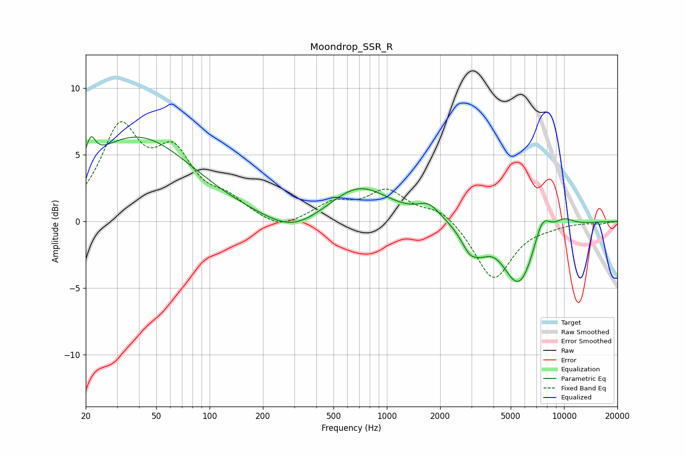

# Moondrop_SSR_R
See [usage instructions](https://github.com/jaakkopasanen/AutoEq#usage) for more options and info.

### Parametric EQs
Apply preamp of -6.5 dB when using parametric equalizer.

|   # | Type    |   Fc (Hz) |    Q |   Gain (dB) |
|-----|---------|-----------|------|-------------|
|   1 | Peaking |        21 | 5.6  |         1.6 |
|   2 | Peaking |        39 | 0.45 |         6.3 |
|   3 | Peaking |       294 | 0.92 |        -1.3 |
|   4 | Peaking |       699 | 0.84 |         2.7 |
|   5 | Peaking |      1725 | 2.27 |         1   |
|   6 | Peaking |      2948 | 2.73 |        -1.7 |
|   7 | Peaking |      3451 | 3    |        -0.7 |
|   8 | Peaking |      5570 | 1.49 |        -4.8 |
|   9 | Peaking |      7518 | 2.86 |         2   |
|  10 | Peaking |     10000 | 2.29 |         0.6 |

### Fixed Band EQs
When using fixed band (also called graphic) equalizer, apply preamp of **-7.6 dB** (if available) and set gains manually with these parameters.

|   # | Type    |   Fc (Hz) |    Q |   Gain (dB) |
|-----|---------|-----------|------|-------------|
|   1 | Peaking |        31 | 1.41 |         6.6 |
|   2 | Peaking |        62 | 1.41 |         4.4 |
|   3 | Peaking |       125 | 1.41 |         1.3 |
|   4 | Peaking |       250 | 1.41 |        -0.8 |
|   5 | Peaking |       500 | 1.41 |         1.3 |
|   6 | Peaking |      1000 | 1.41 |         2.2 |
|   7 | Peaking |      2000 | 1.41 |         1   |
|   8 | Peaking |      4000 | 1.41 |        -4.4 |
|   9 | Peaking |      8000 | 1.41 |        -0.2 |
|  10 | Peaking |     16000 | 1.41 |        -0.2 |

### Graphs

