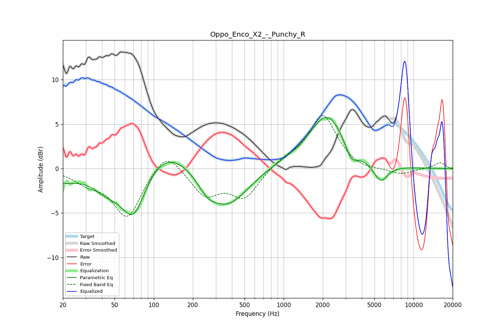

# Oppo_Enco_X2_-_Punchy_R
See [usage instructions](https://github.com/jaakkopasanen/AutoEq#usage) for more options and info.

### Parametric EQs
Apply preamp of -5.9 dB when using parametric equalizer.

|   # | Type    |   Fc (Hz) |    Q |   Gain (dB) |
|-----|---------|-----------|------|-------------|
|   1 | Peaking |        20 | 1.24 |        -1.2 |
|   2 | Peaking |        43 | 1.37 |        -1.7 |
|   3 | Peaking |        70 | 1.41 |        -6.2 |
|   4 | Peaking |       120 | 0.68 |         3.2 |
|   5 | Peaking |       257 | 2.07 |        -1.2 |
|   6 | Peaking |       365 | 0.86 |        -4.5 |
|   7 | Peaking |      1475 | 0.46 |         0.9 |
|   8 | Peaking |      2184 | 1.08 |         5.4 |
|   9 | Peaking |      3316 | 2.78 |        -1.8 |
|  10 | Peaking |      5575 | 2.49 |        -2.1 |

### Fixed Band EQs
When using fixed band (also called graphic) equalizer, apply preamp of **-6.1 dB** (if available) and set gains manually with these parameters.

|   # | Type    |   Fc (Hz) |    Q |   Gain (dB) |
|-----|---------|-----------|------|-------------|
|   1 | Peaking |        31 | 1.41 |        -1.3 |
|   2 | Peaking |        62 | 1.41 |        -5.5 |
|   3 | Peaking |       125 | 1.41 |         2.5 |
|   4 | Peaking |       250 | 1.41 |        -2.9 |
|   5 | Peaking |       500 | 1.41 |        -3.2 |
|   6 | Peaking |      1000 | 1.41 |         0.9 |
|   7 | Peaking |      2000 | 1.41 |         6   |
|   8 | Peaking |      4000 | 1.41 |        -0.4 |
|   9 | Peaking |      8000 | 1.41 |        -0.7 |
|  10 | Peaking |     16000 | 1.41 |         0.7 |

### Graphs

