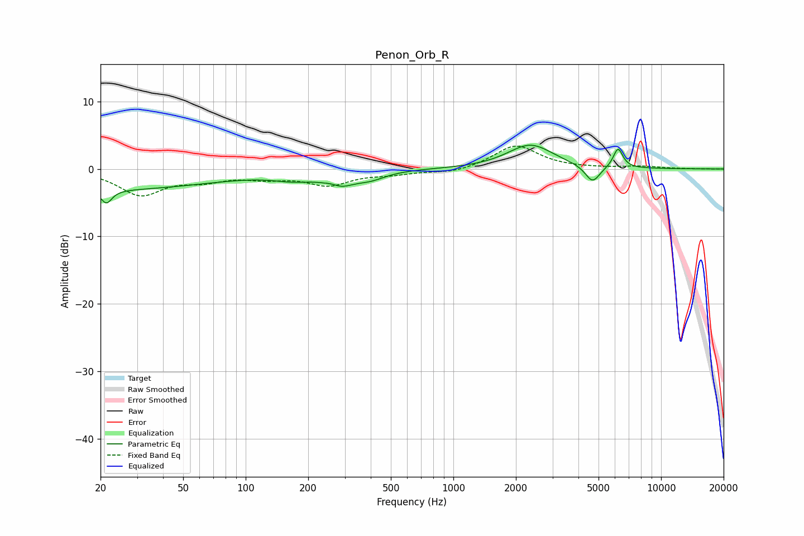

# Penon_Orb_R
See [usage instructions](https://github.com/jaakkopasanen/AutoEq#usage) for more options and info.

### Parametric EQs
Apply preamp of -3.6 dB when using parametric equalizer.

|   # | Type    |   Fc (Hz) |    Q |   Gain (dB) |
|-----|---------|-----------|------|-------------|
|   1 | Peaking |        20 | 0.24 |        -3.1 |
|   2 | Peaking |        21 | 5.7  |        -3.4 |
|   3 | Peaking |        22 | 5.94 |         1.4 |
|   4 | Peaking |       169 | 1.41 |        -1   |
|   5 | Peaking |       263 | 3.2  |         0.9 |
|   6 | Peaking |       277 | 2.1  |        -2.4 |
|   7 | Peaking |       399 | 1.89 |        -1.1 |
|   8 | Peaking |      2349 | 1.28 |         3.6 |
|   9 | Peaking |      4677 | 3.95 |        -2.6 |
|  10 | Peaking |      6206 | 6    |         2.9 |

### Fixed Band EQs
When using fixed band (also called graphic) equalizer, apply preamp of **-3.5 dB** (if available) and set gains manually with these parameters.

|   # | Type    |   Fc (Hz) |    Q |   Gain (dB) |
|-----|---------|-----------|------|-------------|
|   1 | Peaking |        31 | 1.41 |        -3.7 |
|   2 | Peaking |        62 | 1.41 |        -1.4 |
|   3 | Peaking |       125 | 1.41 |        -1   |
|   4 | Peaking |       250 | 1.41 |        -2.2 |
|   5 | Peaking |       500 | 1.41 |        -0.6 |
|   6 | Peaking |      1000 | 1.41 |        -0.6 |
|   7 | Peaking |      2000 | 1.41 |         3.5 |
|   8 | Peaking |      4000 | 1.41 |         0   |
|   9 | Peaking |      8000 | 1.41 |         0.3 |
|  10 | Peaking |     16000 | 1.41 |        -0   |

### Graphs

