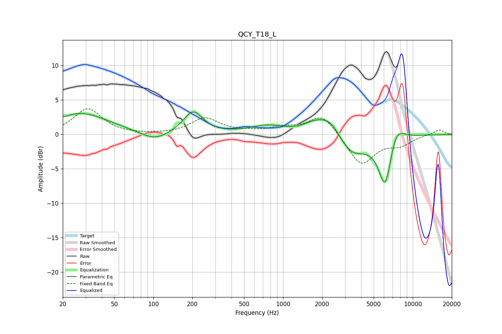

# QCY_T18_L
See [usage instructions](https://github.com/jaakkopasanen/AutoEq#usage) for more options and info.

### Parametric EQs
Apply preamp of -3.3 dB when using parametric equalizer.

|   # | Type    |   Fc (Hz) |    Q |   Gain (dB) |
|-----|---------|-----------|------|-------------|
|   1 | Peaking |        20 | 1.46 |        -0.5 |
|   2 | Peaking |        26 | 0.63 |         3.4 |
|   3 | Peaking |       102 | 1.4  |        -1.3 |
|   4 | Peaking |       202 | 1.9  |         3.3 |
|   5 | Peaking |       761 | 1.01 |         1.2 |
|   6 | Peaking |      1739 | 1.69 |         1.1 |
|   7 | Peaking |      2330 | 1.52 |         3   |
|   8 | Peaking |      3305 | 1.18 |        -3.5 |
|   9 | Peaking |      6135 | 2.62 |        -7.7 |
|  10 | Peaking |      7404 | 2.23 |         3   |

### Fixed Band EQs
When using fixed band (also called graphic) equalizer, apply preamp of **-3.8 dB** (if available) and set gains manually with these parameters.

|   # | Type    |   Fc (Hz) |    Q |   Gain (dB) |
|-----|---------|-----------|------|-------------|
|   1 | Peaking |        31 | 1.41 |         3.7 |
|   2 | Peaking |        62 | 1.41 |        -0   |
|   3 | Peaking |       125 | 1.41 |        -0   |
|   4 | Peaking |       250 | 1.41 |         2.3 |
|   5 | Peaking |       500 | 1.41 |         0.3 |
|   6 | Peaking |      1000 | 1.41 |         0.8 |
|   7 | Peaking |      2000 | 1.41 |         3   |
|   8 | Peaking |      4000 | 1.41 |        -4.5 |
|   9 | Peaking |      8000 | 1.41 |        -1.3 |
|  10 | Peaking |     16000 | 1.41 |         0.7 |

### Graphs

