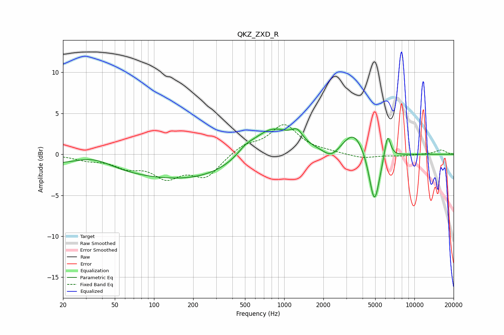

# QKZ_ZXD_R
See [usage instructions](https://github.com/jaakkopasanen/AutoEq#usage) for more options and info.

### Parametric EQs
Apply preamp of -3.2 dB when using parametric equalizer.

|   # | Type    |   Fc (Hz) |    Q |   Gain (dB) |
|-----|---------|-----------|------|-------------|
|   1 | Peaking |        34 | 0.87 |         1.8 |
|   2 | Peaking |        74 | 0.18 |        -2.6 |
|   3 | Peaking |       282 | 0.42 |        -1   |
|   4 | Peaking |       506 | 2.26 |         0.8 |
|   5 | Peaking |       793 | 0.89 |         3.8 |
|   6 | Peaking |      1257 | 3.29 |         1.3 |
|   7 | Peaking |      2300 | 2.25 |        -1.2 |
|   8 | Peaking |      3426 | 1.65 |         2.9 |
|   9 | Peaking |      4932 | 3.42 |        -6.6 |
|  10 | Peaking |      6219 | 5.92 |         3.1 |

### Fixed Band EQs
When using fixed band (also called graphic) equalizer, apply preamp of **-3.7 dB** (if available) and set gains manually with these parameters.

|   # | Type    |   Fc (Hz) |    Q |   Gain (dB) |
|-----|---------|-----------|------|-------------|
|   1 | Peaking |        31 | 1.41 |        -0.6 |
|   2 | Peaking |        62 | 1.41 |        -1.3 |
|   3 | Peaking |       125 | 1.41 |        -2.5 |
|   4 | Peaking |       250 | 1.41 |        -2.6 |
|   5 | Peaking |       500 | 1.41 |         1.1 |
|   6 | Peaking |      1000 | 1.41 |         3.5 |
|   7 | Peaking |      2000 | 1.41 |         0.2 |
|   8 | Peaking |      4000 | 1.41 |        -0.5 |
|   9 | Peaking |      8000 | 1.41 |        -0.2 |
|  10 | Peaking |     16000 | 1.41 |         0.5 |

### Graphs

