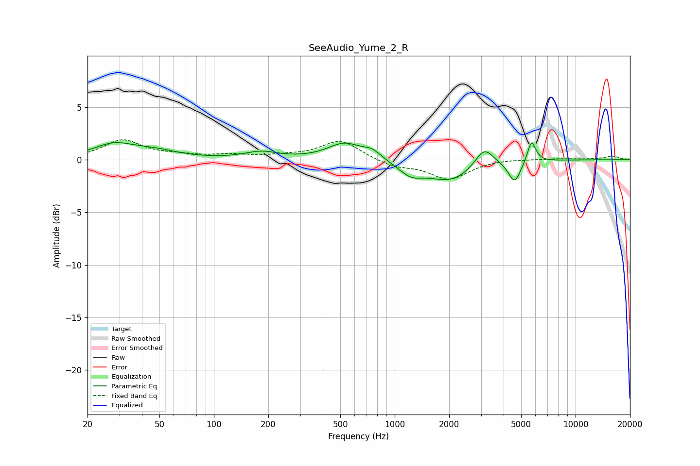

# SeeAudio_Yume_2_R
See [usage instructions](https://github.com/jaakkopasanen/AutoEq#usage) for more options and info.

### Parametric EQs
Apply preamp of -1.7 dB when using parametric equalizer.

|   # | Type    |   Fc (Hz) |    Q |   Gain (dB) |
|-----|---------|-----------|------|-------------|
|   1 | Peaking |        28 | 1.24 |         1.3 |
|   2 | Peaking |        47 | 1.1  |         0.7 |
|   3 | Peaking |       182 | 1.54 |         0.7 |
|   4 | Peaking |       529 | 1.5  |         1.6 |
|   5 | Peaking |       751 | 2.82 |         0.7 |
|   6 | Peaking |      1228 | 2.07 |        -1.1 |
|   7 | Peaking |      2034 | 1.1  |        -1.9 |
|   8 | Peaking |      3124 | 2.8  |         1.9 |
|   9 | Peaking |      4604 | 4.13 |        -2.1 |
|  10 | Peaking |      5712 | 6    |         2.1 |

### Fixed Band EQs
When using fixed band (also called graphic) equalizer, apply preamp of **-2.0 dB** (if available) and set gains manually with these parameters.

|   # | Type    |   Fc (Hz) |    Q |   Gain (dB) |
|-----|---------|-----------|------|-------------|
|   1 | Peaking |        31 | 1.41 |         1.8 |
|   2 | Peaking |        62 | 1.41 |         0.3 |
|   3 | Peaking |       125 | 1.41 |         0.4 |
|   4 | Peaking |       250 | 1.41 |         0.3 |
|   5 | Peaking |       500 | 1.41 |         1.8 |
|   6 | Peaking |      1000 | 1.41 |        -0.6 |
|   7 | Peaking |      2000 | 1.41 |        -1.8 |
|   8 | Peaking |      4000 | 1.41 |         0.1 |
|   9 | Peaking |      8000 | 1.41 |         0.1 |
|  10 | Peaking |     16000 | 1.41 |         0.3 |

### Graphs

