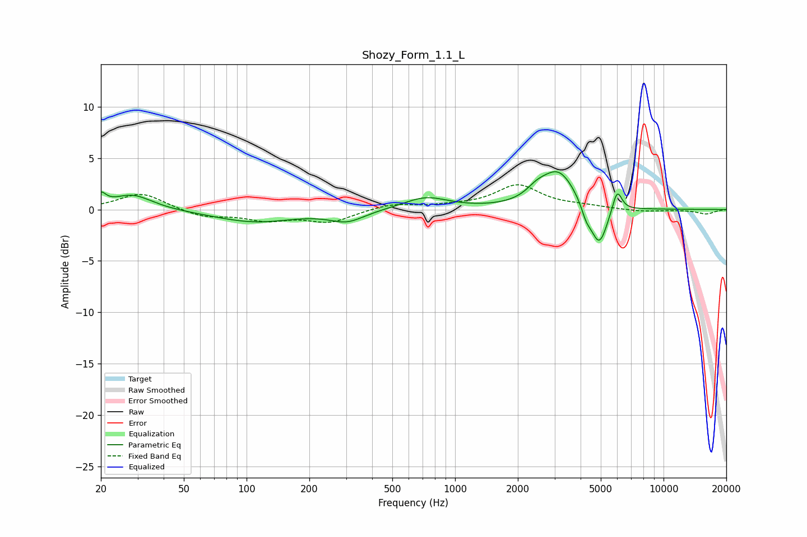

# Shozy_Form_1.1_L
See [usage instructions](https://github.com/jaakkopasanen/AutoEq#usage) for more options and info.

### Parametric EQs
Apply preamp of -3.8 dB when using parametric equalizer.

|   # | Type    |   Fc (Hz) |    Q |   Gain (dB) |
|-----|---------|-----------|------|-------------|
|   1 | Peaking |        20 | 5.98 |         1.1 |
|   2 | Peaking |        28 | 1.5  |         1.5 |
|   3 | Peaking |       109 | 0.73 |        -1.2 |
|   4 | Peaking |       304 | 1.71 |        -1.1 |
|   5 | Peaking |       724 | 1.32 |         1.2 |
|   6 | Peaking |      2461 | 2.92 |         0.8 |
|   7 | Peaking |      3133 | 1.68 |         3.7 |
|   8 | Peaking |      4257 | 5.95 |        -1.2 |
|   9 | Peaking |      4906 | 3.47 |        -4   |
|  10 | Peaking |      5989 | 6    |         2.2 |

### Fixed Band EQs
When using fixed band (also called graphic) equalizer, apply preamp of **-2.5 dB** (if available) and set gains manually with these parameters.

|   # | Type    |   Fc (Hz) |    Q |   Gain (dB) |
|-----|---------|-----------|------|-------------|
|   1 | Peaking |        31 | 1.41 |         1.6 |
|   2 | Peaking |        62 | 1.41 |        -0.7 |
|   3 | Peaking |       125 | 1.41 |        -0.9 |
|   4 | Peaking |       250 | 1.41 |        -1.2 |
|   5 | Peaking |       500 | 1.41 |         0.6 |
|   6 | Peaking |      1000 | 1.41 |         0.3 |
|   7 | Peaking |      2000 | 1.41 |         2.3 |
|   8 | Peaking |      4000 | 1.41 |         0.3 |
|   9 | Peaking |      8000 | 1.41 |        -0.2 |
|  10 | Peaking |     16000 | 1.41 |        -0.4 |

### Graphs

