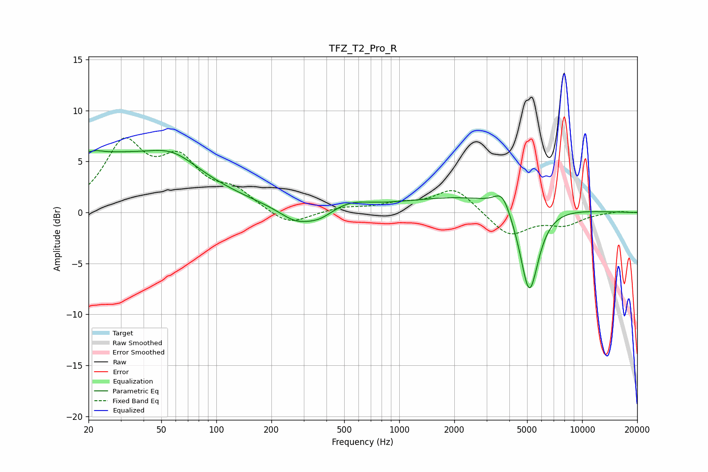

# TFZ_T2_Pro_R
See [usage instructions](https://github.com/jaakkopasanen/AutoEq#usage) for more options and info.

### Parametric EQs
Apply preamp of -6.2 dB when using parametric equalizer.

|   # | Type    |   Fc (Hz) |    Q |   Gain (dB) |
|-----|---------|-----------|------|-------------|
|   1 | Peaking |        20 | 0.22 |         5.7 |
|   2 | Peaking |        21 | 6    |        -3   |
|   3 | Peaking |        21 | 5.88 |         3.2 |
|   4 | Peaking |        58 | 1.09 |         1.7 |
|   5 | Peaking |       273 | 1.52 |        -1.4 |
|   6 | Peaking |       368 | 1.94 |        -0.8 |
|   7 | Peaking |       536 | 1.33 |         0.8 |
|   8 | Peaking |      2575 | 0.37 |         1.6 |
|   9 | Peaking |      3662 | 3.19 |         1.8 |
|  10 | Peaking |      5142 | 2.67 |        -8.9 |

### Fixed Band EQs
When using fixed band (also called graphic) equalizer, apply preamp of **-7.4 dB** (if available) and set gains manually with these parameters.

|   # | Type    |   Fc (Hz) |    Q |   Gain (dB) |
|-----|---------|-----------|------|-------------|
|   1 | Peaking |        31 | 1.41 |         6.4 |
|   2 | Peaking |        62 | 1.41 |         4.4 |
|   3 | Peaking |       125 | 1.41 |         1.8 |
|   4 | Peaking |       250 | 1.41 |        -1.4 |
|   5 | Peaking |       500 | 1.41 |         0.5 |
|   6 | Peaking |      1000 | 1.41 |         0.7 |
|   7 | Peaking |      2000 | 1.41 |         2.4 |
|   8 | Peaking |      4000 | 1.41 |        -2.4 |
|   9 | Peaking |      8000 | 1.41 |        -1.1 |
|  10 | Peaking |     16000 | 1.41 |         0.1 |

### Graphs

