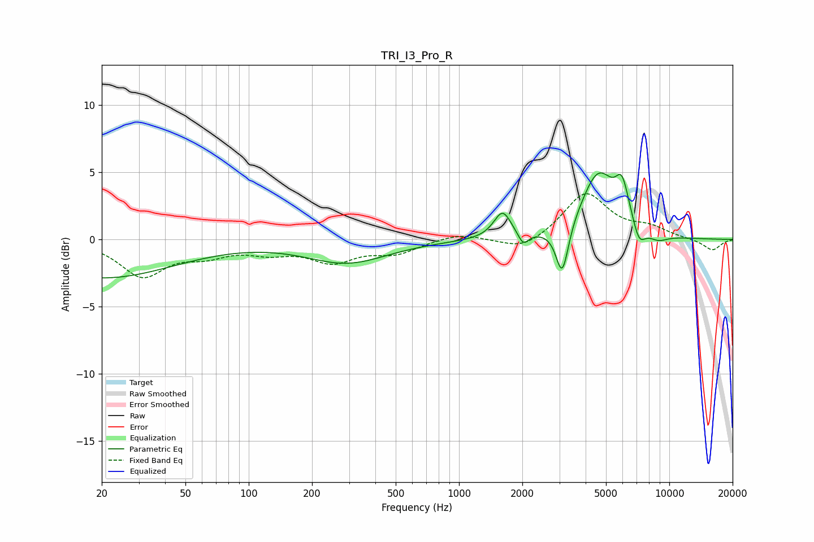

# TRI_I3_Pro_R
See [usage instructions](https://github.com/jaakkopasanen/AutoEq#usage) for more options and info.

### Parametric EQs
Apply preamp of -5.1 dB when using parametric equalizer.

|   # | Type    |   Fc (Hz) |    Q |   Gain (dB) |
|-----|---------|-----------|------|-------------|
|   1 | Peaking |        20 | 0.4  |        -2.8 |
|   2 | Peaking |       293 | 0.73 |        -1.7 |
|   3 | Peaking |      1610 | 3.45 |         2   |
|   4 | Peaking |      2020 | 5.74 |        -0.9 |
|   5 | Peaking |      3097 | 4.74 |        -3.8 |
|   6 | Peaking |      4603 | 1.69 |         4.9 |
|   7 | Peaking |      5939 | 4.59 |         2.3 |
|   8 | Peaking |      6282 | 3.71 |         0.5 |
|   9 | Peaking |      7179 | 4.54 |        -1.5 |
|  10 | Peaking |      8826 | 2.64 |        -0.5 |

### Fixed Band EQs
When using fixed band (also called graphic) equalizer, apply preamp of **-3.5 dB** (if available) and set gains manually with these parameters.

|   # | Type    |   Fc (Hz) |    Q |   Gain (dB) |
|-----|---------|-----------|------|-------------|
|   1 | Peaking |        31 | 1.41 |        -2.6 |
|   2 | Peaking |        62 | 1.41 |        -0.9 |
|   3 | Peaking |       125 | 1.41 |        -0.8 |
|   4 | Peaking |       250 | 1.41 |        -1.5 |
|   5 | Peaking |       500 | 1.41 |        -0.9 |
|   6 | Peaking |      1000 | 1.41 |         0.5 |
|   7 | Peaking |      2000 | 1.41 |        -0.9 |
|   8 | Peaking |      4000 | 1.41 |         3.5 |
|   9 | Peaking |      8000 | 1.41 |         0.7 |
|  10 | Peaking |     16000 | 1.41 |        -0.8 |

### Graphs

