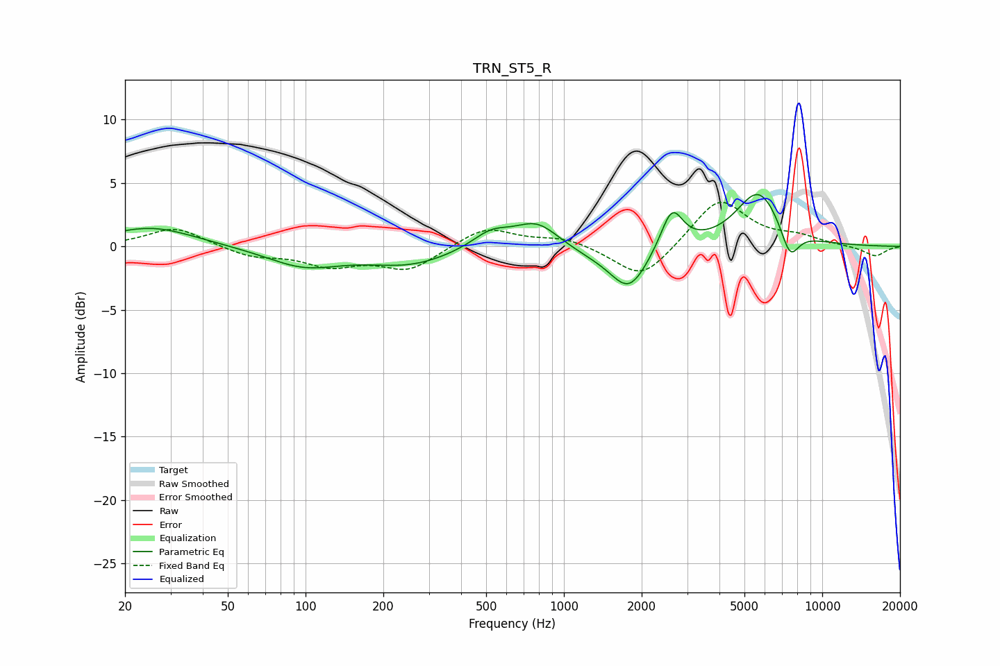

# TRN_ST5_R
See [usage instructions](https://github.com/jaakkopasanen/AutoEq#usage) for more options and info.

### Parametric EQs
Apply preamp of -4.2 dB when using parametric equalizer.

|   # | Type    |   Fc (Hz) |    Q |   Gain (dB) |
|-----|---------|-----------|------|-------------|
|   1 | Peaking |        25 | 0.85 |         1.5 |
|   2 | Peaking |        98 | 0.99 |        -1.5 |
|   3 | Peaking |       253 | 0.85 |        -1.4 |
|   4 | Peaking |       523 | 1.87 |         1.3 |
|   5 | Peaking |       787 | 1.63 |         2   |
|   6 | Peaking |      1302 | 1.13 |        -0.6 |
|   7 | Peaking |      1789 | 1.96 |        -3.3 |
|   8 | Peaking |      2619 | 3.32 |         3.2 |
|   9 | Peaking |      5672 | 1.6  |         4.4 |
|  10 | Peaking |      7499 | 3.79 |        -2.4 |

### Fixed Band EQs
When using fixed band (also called graphic) equalizer, apply preamp of **-3.6 dB** (if available) and set gains manually with these parameters.

|   # | Type    |   Fc (Hz) |    Q |   Gain (dB) |
|-----|---------|-----------|------|-------------|
|   1 | Peaking |        31 | 1.41 |         1.5 |
|   2 | Peaking |        62 | 1.41 |        -0.8 |
|   3 | Peaking |       125 | 1.41 |        -1.4 |
|   4 | Peaking |       250 | 1.41 |        -1.8 |
|   5 | Peaking |       500 | 1.41 |         1.6 |
|   6 | Peaking |      1000 | 1.41 |         0.7 |
|   7 | Peaking |      2000 | 1.41 |        -2.8 |
|   8 | Peaking |      4000 | 1.41 |         3.8 |
|   9 | Peaking |      8000 | 1.41 |         0.6 |
|  10 | Peaking |     16000 | 1.41 |        -0.8 |

### Graphs

