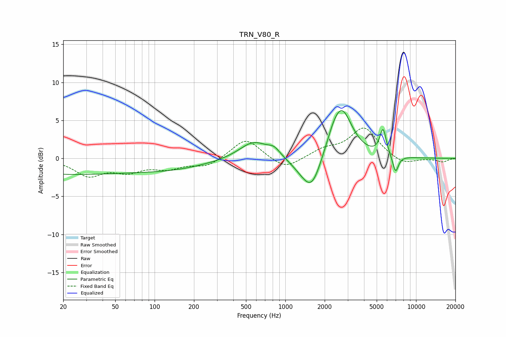

# TRN_V80_R
See [usage instructions](https://github.com/jaakkopasanen/AutoEq#usage) for more options and info.

### Parametric EQs
Apply preamp of -6.4 dB when using parametric equalizer.

|   # | Type    |   Fc (Hz) |    Q |   Gain (dB) |
|-----|---------|-----------|------|-------------|
|   1 | Peaking |        20 | 0.27 |        -2   |
|   2 | Peaking |       137 | 0.49 |        -1.2 |
|   3 | Peaking |       573 | 1.27 |         2.4 |
|   4 | Peaking |       820 | 3.09 |         0.9 |
|   5 | Peaking |      1307 | 1.69 |        -0.8 |
|   6 | Peaking |      1595 | 1.93 |        -4.3 |
|   7 | Peaking |      2331 | 2.38 |         1.5 |
|   8 | Peaking |      2714 | 1.76 |         6.1 |
|   9 | Peaking |      5592 | 5.64 |         3.4 |
|  10 | Peaking |      6970 | 6    |        -2.3 |

### Fixed Band EQs
When using fixed band (also called graphic) equalizer, apply preamp of **-4.1 dB** (if available) and set gains manually with these parameters.

|   # | Type    |   Fc (Hz) |    Q |   Gain (dB) |
|-----|---------|-----------|------|-------------|
|   1 | Peaking |        31 | 1.41 |        -2.2 |
|   2 | Peaking |        62 | 1.41 |        -1.5 |
|   3 | Peaking |       125 | 1.41 |        -1.1 |
|   4 | Peaking |       250 | 1.41 |        -1.1 |
|   5 | Peaking |       500 | 1.41 |         2.7 |
|   6 | Peaking |      1000 | 1.41 |        -1.6 |
|   7 | Peaking |      2000 | 1.41 |         1.1 |
|   8 | Peaking |      4000 | 1.41 |         4   |
|   9 | Peaking |      8000 | 1.41 |        -0.9 |
|  10 | Peaking |     16000 | 1.41 |        -0.5 |

### Graphs

