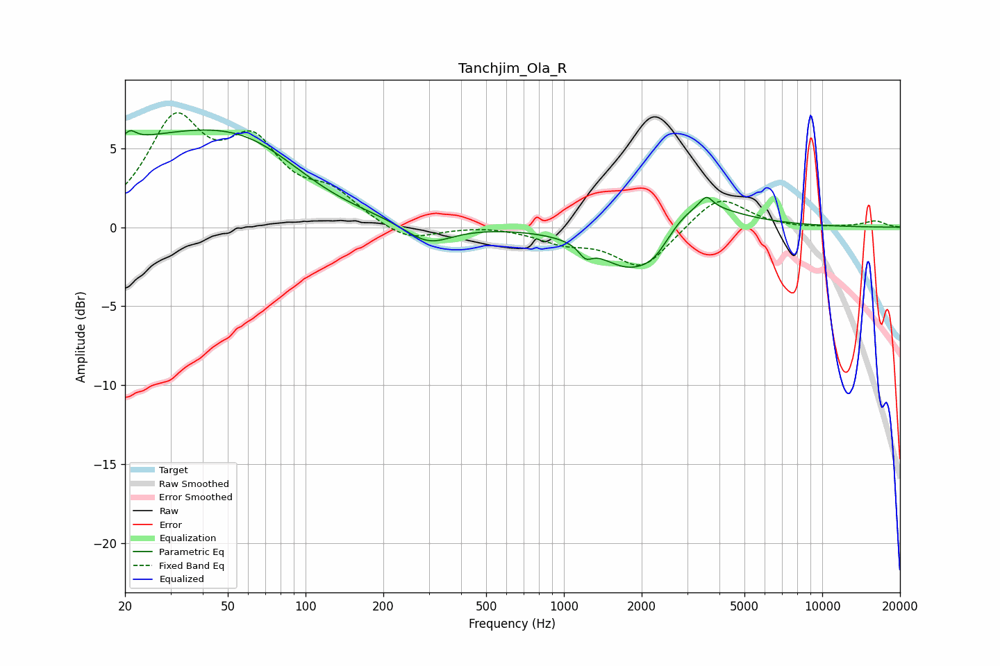

# Tanchjim_Ola_R
See [usage instructions](https://github.com/jaakkopasanen/AutoEq#usage) for more options and info.

### Parametric EQs
Apply preamp of -6.3 dB when using parametric equalizer.

|   # | Type    |   Fc (Hz) |    Q |   Gain (dB) |
|-----|---------|-----------|------|-------------|
|   1 | Peaking |        21 | 5.88 |         0.7 |
|   2 | Peaking |        30 | 0.27 |         5.3 |
|   3 | Peaking |        61 | 0.67 |         1.5 |
|   4 | Peaking |       119 | 0.7  |        -0.8 |
|   5 | Peaking |       298 | 1.51 |        -1.4 |
|   6 | Peaking |      1213 | 5.64 |        -0.7 |
|   7 | Peaking |      1813 | 1.11 |        -3.2 |
|   8 | Peaking |      2271 | 2.2  |        -1.2 |
|   9 | Peaking |      3017 | 0.91 |         2.4 |
|  10 | Peaking |      3562 | 5.89 |         0.7 |

### Fixed Band EQs
When using fixed band (also called graphic) equalizer, apply preamp of **-7.3 dB** (if available) and set gains manually with these parameters.

|   # | Type    |   Fc (Hz) |    Q |   Gain (dB) |
|-----|---------|-----------|------|-------------|
|   1 | Peaking |        31 | 1.41 |         6.3 |
|   2 | Peaking |        62 | 1.41 |         4.6 |
|   3 | Peaking |       125 | 1.41 |         1.8 |
|   4 | Peaking |       250 | 1.41 |        -1   |
|   5 | Peaking |       500 | 1.41 |         0.1 |
|   6 | Peaking |      1000 | 1.41 |        -0.8 |
|   7 | Peaking |      2000 | 1.41 |        -2.6 |
|   8 | Peaking |      4000 | 1.41 |         2.1 |
|   9 | Peaking |      8000 | 1.41 |        -0.1 |
|  10 | Peaking |     16000 | 1.41 |         0.4 |

### Graphs

