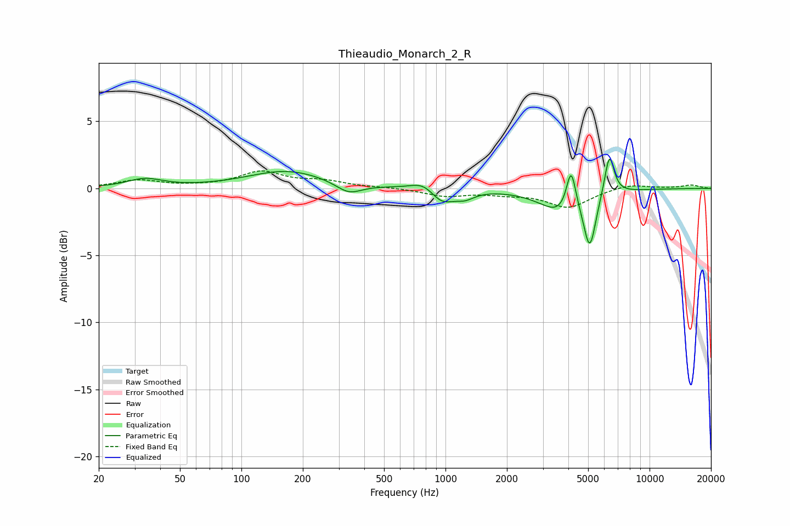

# Thieaudio_Monarch_2_R
See [usage instructions](https://github.com/jaakkopasanen/AutoEq#usage) for more options and info.

### Parametric EQs
Apply preamp of -2.3 dB when using parametric equalizer.

|   # | Type    |   Fc (Hz) |    Q |   Gain (dB) |
|-----|---------|-----------|------|-------------|
|   1 | Peaking |        34 | 1.65 |         0.7 |
|   2 | Peaking |       167 | 0.73 |         1.3 |
|   3 | Peaking |       336 | 2.24 |        -0.8 |
|   4 | Peaking |       785 | 2.31 |         0.7 |
|   5 | Peaking |       958 | 2.32 |        -1.2 |
|   6 | Peaking |      1248 | 3.09 |        -0.5 |
|   7 | Peaking |      3701 | 1.4  |        -1.8 |
|   8 | Peaking |      4127 | 5.99 |         3.2 |
|   9 | Peaking |      5095 | 4.78 |        -3.9 |
|  10 | Peaking |      6354 | 5.85 |         3.1 |

### Fixed Band EQs
When using fixed band (also called graphic) equalizer, apply preamp of **-1.4 dB** (if available) and set gains manually with these parameters.

|   # | Type    |   Fc (Hz) |    Q |   Gain (dB) |
|-----|---------|-----------|------|-------------|
|   1 | Peaking |        31 | 1.41 |         0.6 |
|   2 | Peaking |        62 | 1.41 |         0.1 |
|   3 | Peaking |       125 | 1.41 |         1.2 |
|   4 | Peaking |       250 | 1.41 |         0.5 |
|   5 | Peaking |       500 | 1.41 |         0.1 |
|   6 | Peaking |      1000 | 1.41 |        -0.5 |
|   7 | Peaking |      2000 | 1.41 |        -0.3 |
|   8 | Peaking |      4000 | 1.41 |        -1.4 |
|   9 | Peaking |      8000 | 1.41 |         0.4 |
|  10 | Peaking |     16000 | 1.41 |         0.2 |

### Graphs

