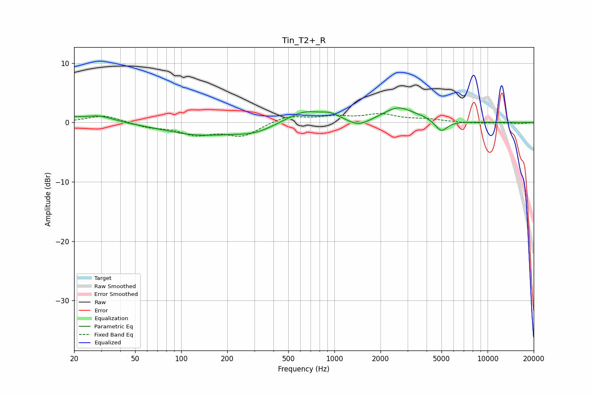

# Tin_T2+_R
See [usage instructions](https://github.com/jaakkopasanen/AutoEq#usage) for more options and info.

### Parametric EQs
Apply preamp of -2.5 dB when using parametric equalizer.

|   # | Type    |   Fc (Hz) |    Q |   Gain (dB) |
|-----|---------|-----------|------|-------------|
|   1 | Peaking |        20 | 3.7  |         0.4 |
|   2 | Peaking |        29 | 1.35 |         1.3 |
|   3 | Peaking |       133 | 0.6  |        -2   |
|   4 | Peaking |       300 | 1.15 |        -1.2 |
|   5 | Peaking |       628 | 1.27 |         2   |
|   6 | Peaking |       943 | 2.16 |         1   |
|   7 | Peaking |      1439 | 2.05 |        -1.1 |
|   8 | Peaking |      2615 | 1.43 |         2.5 |
|   9 | Peaking |      3765 | 2.55 |         0.3 |
|  10 | Peaking |      4989 | 3.59 |        -1.9 |

### Fixed Band EQs
When using fixed band (also called graphic) equalizer, apply preamp of **-1.6 dB** (if available) and set gains manually with these parameters.

|   # | Type    |   Fc (Hz) |    Q |   Gain (dB) |
|-----|---------|-----------|------|-------------|
|   1 | Peaking |        31 | 1.41 |         1.3 |
|   2 | Peaking |        62 | 1.41 |        -0.7 |
|   3 | Peaking |       125 | 1.41 |        -1.8 |
|   4 | Peaking |       250 | 1.41 |        -2.2 |
|   5 | Peaking |       500 | 1.41 |         1.2 |
|   6 | Peaking |      1000 | 1.41 |         0.8 |
|   7 | Peaking |      2000 | 1.41 |         1.3 |
|   8 | Peaking |      4000 | 1.41 |         0.5 |
|   9 | Peaking |      8000 | 1.41 |        -0.1 |
|  10 | Peaking |     16000 | 1.41 |        -0.2 |

### Graphs

